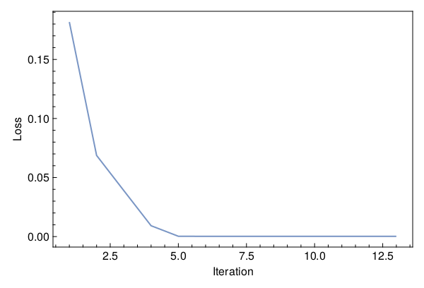

<a id='Training-a-Neural-ODE-to-Model-Gravitational-Waveforms'></a>

# Training a Neural ODE to Model Gravitational Waveforms


This code is adapted from [Astroinformatics/ScientificMachineLearning](https://github.com/Astroinformatics/ScientificMachineLearning/blob/c93aac3a460d70b4cce98836b677fd9b732e94b7/neuralode_gw.ipynb)


The code has been minimally adapted from [Keith et. al. 2021](https://arxiv.org/abs/2102.12695) which originally used Flux.jl


<a id='Package-Imports'></a>

## Package Imports


```julia
using Lux, ComponentArrays, LineSearches, LuxAMDGPU, LuxCUDA, OrdinaryDiffEq,
    Optimization, OptimizationOptimJL, Random, SciMLSensitivity
using CairoMakie, MakiePublication
CUDA.allowscalar(false)
```


<a id='Define-some-Utility-Functions'></a>

## Define some Utility Functions


::: tip


This section can be skipped. It defines functions to simulate the model, however, from a scientific machine learning perspective, isn't super relevant.


:::


We need a very crude 2-body path. Assume the 1-body motion is a newtonian 2-body position vector $r = r_1 - r_2$ and use Newtonian formulas to get $r_1$, $r_2$ (e.g. Theoretical Mechanics of Particles and Continua 4.3)


```julia
function one2two(path, m₁, m₂)
    M = m₁ + m₂
    r₁ = m₂ / M .* path
    r₂ = -m₁ / M .* path
    return r₁, r₂
end
```


```
one2two (generic function with 1 method)
```


Next we define a function to perform the change of variables: $(\chi(t),\phi(t)) \mapsto (x(t),y(t))$


```julia
@views function soln2orbit(soln, model_params=nothing)
    @assert size(soln, 1) ∈ [2, 4] "size(soln,1) must be either 2 or 4"

    if size(soln, 1) == 2
        χ = soln[1, :]
        ϕ = soln[2, :]

        @assert length(model_params)==3 "model_params must have length 3 when size(soln,2) = 2"
        p, M, e = model_params
    else
        χ = soln[1, :]
        ϕ = soln[2, :]
        p = soln[3, :]
        e = soln[4, :]
    end

    r = p ./ (1 .+ e .* cos.(χ))
    x = r .* cos.(ϕ)
    y = r .* sin.(ϕ)

    orbit = vcat(x', y')
    return orbit
end
```


```
soln2orbit (generic function with 2 methods)
```


This function uses second-order one-sided difference stencils at the endpoints; see https://doi.org/10.1090/S0025-5718-1988-0935077-0


```julia
function d_dt(v::AbstractVector, dt)
    a = -3 / 2 * v[1] + 2 * v[2] - 1 / 2 * v[3]
    b = (v[3:end] .- v[1:(end - 2)]) / 2
    c = 3 / 2 * v[end] - 2 * v[end - 1] + 1 / 2 * v[end - 2]
    return [a; b; c] / dt
end
```


```
d_dt (generic function with 1 method)
```


This function uses second-order one-sided difference stencils at the endpoints; see https://doi.org/10.1090/S0025-5718-1988-0935077-0


```julia
function d2_dt2(v::AbstractVector, dt)
    a = 2 * v[1] - 5 * v[2] + 4 * v[3] - v[4]
    b = v[1:(end - 2)] .- 2 * v[2:(end - 1)] .+ v[3:end]
    c = 2 * v[end] - 5 * v[end - 1] + 4 * v[end - 2] - v[end - 3]
    return [a; b; c] / (dt^2)
end
```


```
d2_dt2 (generic function with 1 method)
```


Now we define a function to compute the trace-free moment tensor from the orbit


```julia
function orbit2tensor(orbit, component, mass=1)
    x = orbit[1, :]
    y = orbit[2, :]

    Ixx = x .^ 2
    Iyy = y .^ 2
    Ixy = x .* y
    trace = Ixx .+ Iyy

    if component[1] == 1 && component[2] == 1
        tmp = Ixx .- trace ./ 3
    elseif component[1] == 2 && component[2] == 2
        tmp = Iyy .- trace ./ 3
    else
        tmp = Ixy
    end

    return mass .* tmp
end

function h_22_quadrupole_components(dt, orbit, component, mass=1)
    mtensor = orbit2tensor(orbit, component, mass)
    mtensor_ddot = d2_dt2(mtensor, dt)
    return 2 * mtensor_ddot
end

function h_22_quadrupole(dt, orbit, mass=1)
    h11 = h_22_quadrupole_components(dt, orbit, (1, 1), mass)
    h22 = h_22_quadrupole_components(dt, orbit, (2, 2), mass)
    h12 = h_22_quadrupole_components(dt, orbit, (1, 2), mass)
    return h11, h12, h22
end

function h_22_strain_one_body(dt::T, orbit) where {T}
    h11, h12, h22 = h_22_quadrupole(dt, orbit)

    h₊ = h11 - h22
    hₓ = T(2) * h12

    scaling_const = √(T(π) / 5)
    return scaling_const * h₊, -scaling_const * hₓ
end

function h_22_quadrupole_two_body(dt, orbit1, mass1, orbit2, mass2)
    h11_1, h12_1, h22_1 = h_22_quadrupole(dt, orbit1, mass1)
    h11_2, h12_2, h22_2 = h_22_quadrupole(dt, orbit2, mass2)
    h11 = h11_1 + h11_2
    h12 = h12_1 + h12_2
    h22 = h22_1 + h22_2
    return h11, h12, h22
end

function h_22_strain_two_body(dt::T, orbit1, mass1, orbit2, mass2) where {T}
    # compute (2,2) mode strain from orbits of BH 1 of mass1 and BH2 of mass 2

    @assert abs(mass1 + mass2 - 1.0)<1e-12 "Masses do not sum to unity"

    h11, h12, h22 = h_22_quadrupole_two_body(dt, orbit1, mass1, orbit2, mass2)

    h₊ = h11 - h22
    hₓ = T(2) * h12

    scaling_const = √(T(π) / 5)
    return scaling_const * h₊, -scaling_const * hₓ
end

function compute_waveform(dt::T, soln, mass_ratio, model_params=nothing) where {T}
    @assert mass_ratio≤1 "mass_ratio must be <= 1"
    @assert mass_ratio≥0 "mass_ratio must be non-negative"

    orbit = soln2orbit(soln, model_params)
    if mass_ratio > 0
        m₂ = inv(T(1) + mass_ratio)
        m₁ = mass_ratio * m₂

        orbit₁, orbit₂ = one2two(orbit, m₁, m₂)
        waveform = h_22_strain_two_body(dt, orbit1, mass1, orbit2, mass2)
    else
        waveform = h_22_strain_one_body(dt, orbit)
    end
    return waveform
end
```


```
compute_waveform (generic function with 2 methods)
```


<a id='Simulating-the-True-Model'></a>

## Simulating the True Model


`RelativisticOrbitModel` defines system of odes which describes motion of point like particle in schwarzschild background, uses


$$
u[1] = \chi
$$


$$
u[2] = \phi
$$


where, $p$, $M$, and $e$ are constants


```julia
function RelativisticOrbitModel(u, (p, M, e), t)
    χ, ϕ = u

    numer = (p - 2 - 2 * e * cos(χ)) * (1 + e * cos(χ))^2
    denom = sqrt((p - 2)^2 - 4 * e^2)

    χ̇ = numer * sqrt(p - 6 - 2 * e * cos(χ)) / (M * (p^2) * denom)
    ϕ̇ = numer / (M * (p^(3 / 2)) * denom)

    return [χ̇, ϕ̇]
end

mass_ratio = 0.0         # test particle
u0 = Float64[π, 0.0]     # initial conditions
datasize = 250
tspan = (0.0f0, 6.0f4)   # timespace for GW waveform
tsteps = range(tspan[1], tspan[2]; length=datasize)  # time at each timestep
dt_data = tsteps[2] - tsteps[1]
dt = 100.0
const ode_model_params = [100.0, 1.0, 0.5]; # p, M, e
```


Let's simulate the true model and plot the results using `OrdinaryDiffEq.jl`


```julia
prob = ODEProblem(RelativisticOrbitModel, u0, tspan, ode_model_params)
soln = Array(solve(prob, RK4(); saveat=tsteps, dt, adaptive=false))
waveform = first(compute_waveform(dt_data, soln, mass_ratio, ode_model_params))

fig = with_theme(theme_web()) do
    fig = Figure()
    ax = CairoMakie.Axis(fig[1, 1]; xlabel="Time", ylabel="Waveform")

    l = lines!(ax, tsteps, waveform; linewidth=2, alpha=0.75)
    s = scatter!(ax, tsteps, waveform; markershape=:circle, markeralpha=0.25, alpha=0.5)

    axislegend(ax, [[l, s]], ["Waveform Data"])

    return fig
end
```


<a id='Defiing-a-Neural-Network-Model'></a>

## Defiing a Neural Network Model


Next, we define the neural network model that takes 1 input (time) and has two outputs. We'll make a function `ODE_model` that takes the initial conditions, neural network parameters and a time as inputs and returns the derivatives.


It is typically never recommended to use globals but incase you do use them, make sure to mark them as `const`.


We will deviate from the standard Neural Network initialization and use `WeightInitializers.jl`,


```julia
const nn = Chain(Base.Fix1(broadcast, cos),
    Dense(1 => 32, cos; init_weight=truncated_normal(; std=1e-4)),
    Dense(32 => 32, cos; init_weight=truncated_normal(; std=1e-4)),
    Dense(32 => 2; init_weight=truncated_normal(; std=1e-4)))
ps, st = Lux.setup(MersenneTwister(), nn)
```


```
((layer_1 = NamedTuple(), layer_2 = (weight = Float32[8.802241f-5; -7.0970025f-5; -5.2054736f-5; 8.542409f-5; -5.693706f-5; 8.404417f-5; -4.158444f-5; -0.00017560543; -2.2600534f-5; 4.7308138f-5; -8.675193f-5; 3.518843f-5; 7.866275f-5; -0.00017154073; -3.524108f-5; -3.1043102f-5; 0.0001488576; -0.00013514962; 5.942509f-5; 3.8518556f-5; 4.621775f-5; 3.208087f-5; 5.8403508f-5; 0.00010484492; -0.00010005582; -2.6426074f-5; 7.340942f-5; -2.7159524f-5; 4.8514197f-5; -1.1078326f-5; 2.072917f-5; -8.84727f-5;;], bias = Float32[0.0; 0.0; 0.0; 0.0; 0.0; 0.0; 0.0; 0.0; 0.0; 0.0; 0.0; 0.0; 0.0; 0.0; 0.0; 0.0; 0.0; 0.0; 0.0; 0.0; 0.0; 0.0; 0.0; 0.0; 0.0; 0.0; 0.0; 0.0; 0.0; 0.0; 0.0; 0.0;;]), layer_3 = (weight = Float32[-9.385531f-5 -9.589489f-5 5.325435f-5 -0.00018953171 0.00014450701 0.0002821942 -2.7602591f-5 0.00017293543 0.00015760364 -4.348192f-5 -3.0028017f-5 0.00014068239 -2.9303583f-5 7.677278f-5 9.347176f-5 -1.9530487f-5 -7.245637f-5 6.3470807f-6 3.0199737f-5 -0.0001242505 0.0001503523 -0.00011473439 -5.0605337f-5 2.527813f-5 4.1948864f-5 -0.00012422477 2.3729155f-5 0.00014747572 4.3744592f-5 -0.0001262482 0.00012330523 1.9481577f-5; 1.1307602f-5 -6.0043752f-5 9.64063f-5 -4.5521458f-5 7.129537f-6 4.5060024f-5 7.9463325f-6 0.00011651613 -2.4959656f-5 -9.342233f-5 -0.00015759227 0.00023489066 -0.00014966549 -2.5430998f-5 -0.00013589088 1.4425716f-6 -8.4460975f-5 -1.9985013f-5 2.6502326f-5 0.00011883624 4.8065143f-5 7.455765f-5 7.598479f-5 -5.7794878f-5 1.8159688f-5 3.149495f-5 0.00012273907 -0.0001169008 9.789474f-5 0.00011055219 0.0001257502 -0.0001598543; -3.518347f-5 -0.00013561793 -5.5505585f-5 -1.309373f-5 -0.00014999976 0.00012622088 -0.00016427173 5.2982625f-5 -5.4076004f-6 -0.00012391304 -2.6641344f-5 5.8308775f-5 -5.7140776f-5 -5.6937763f-5 -0.0001797375 -2.5014007f-5 -7.395607f-5 -9.779202f-5 -9.430551f-8 3.464956f-5 -4.4565713f-5 4.5303117f-5 5.550698f-5 -0.0002075296 9.9163935f-6 0.00011547157 0.00016270077 -4.7709304f-6 1.37565585f-5 -3.490316f-5 6.9054436f-6 9.7613636f-5; -3.12504f-5 6.148608f-5 -0.0001998208 -1.1330368f-5 0.00013744194 -0.00018681778 -4.599031f-5 5.2392345f-5 1.3123356f-5 5.2405885f-5 -3.6822992f-5 -0.000102176295 -7.1925446f-5 8.326639f-5 0.00014132928 0.00021044155 0.00011143466 -0.0001439324 -0.00014217342 -0.00021360216 -8.193538f-6 -6.115398f-5 0.00018899425 -5.1844627f-6 4.8748378f-5 0.00012665792 0.00015418559 -5.943689f-5 0.00018738992 -4.8832255f-5 -0.00012171053 -5.0607545f-5; -0.00016880689 -1.4925984f-6 0.000115896444 7.9747915f-5 0.00013039756 8.2668514f-5 1.831391f-5 8.390269f-5 0.00015702464 8.263097f-6 -6.412597f-5 9.463795f-5 -3.6146164f-5 -7.538875f-5 2.6418926f-5 -7.357383f-5 -9.073309f-5 -6.582854f-5 2.0621135f-5 1.7599312f-5 -6.1147744f-5 -6.846163f-5 1.9949988f-5 1.1783908f-5 -3.921047f-5 5.15119f-6 -0.00013188888 -7.0102586f-5 -5.043895f-5 4.5410623f-5 9.215294f-5 2.0536227f-5; -6.0201313f-5 5.520296f-5 1.9231671f-5 -0.00020798115 4.5831603f-6 0.00016967417 0.0001515338 -4.6875728f-5 -0.0001751139 6.396662f-5 -8.684979f-5 0.00015255454 -9.9342724f-5 9.61843f-5 -5.449845f-5 -3.6935737f-5 -0.00013721031 -2.6187268f-5 -0.00015249086 -0.00010965708 8.943079f-5 7.771511f-5 5.411054f-5 4.0664374f-5 -8.386441f-5 2.5495045f-5 -0.00010137754 -0.000121349396 -0.00010923682 0.0001414292 -1.9719871f-5 -9.242114f-5; 5.3413296f-5 -0.0001872269 -6.326492f-5 0.00012100413 9.4735915f-5 -4.6512476f-5 -0.00015913417 9.266949f-5 -0.00014001354 -9.035428f-5 -1.43841235f-5 0.00014187652 9.860174f-5 -5.9621f-5 -7.121741f-5 0.000249476 -2.7789356f-5 5.4885862f-5 7.992648f-5 0.00018023793 2.2907552f-5 2.3458715f-5 0.000111189314 -0.00014944942 0.0001519635 9.997388f-5 -8.3050116f-5 0.00011545848 0.00013722334 0.00015626164 3.6003203f-5 -1.8062821f-5; 0.00020222903 -0.00015220219 0.00022341151 0.00020385679 -2.6516564f-5 9.263878f-5 -6.0914304f-6 -1.5703266f-5 -0.00023176214 -4.277383f-6 7.700856f-5 2.2688888f-5 3.7919538f-6 0.00014325338 6.817567f-5 -7.048308f-5 -3.833187f-5 0.00017688176 0.00010695641 -8.29593f-6 -0.000108860884 0.00018372817 7.283546f-5 5.8766884f-5 -0.00015903854 6.4029184f-5 -8.836196f-5 -0.00018560125 -0.00012367977 1.8015957f-5 4.426198f-5 0.00018639426; 0.00014607946 -0.00012473094 9.1517904f-5 -0.00015777779 1.3517205f-5 0.00013011112 -0.00022138165 -7.1965434f-5 -6.416716f-5 -6.0412163f-5 -0.00010857932 -0.000106818654 -2.1230466f-5 1.8669702f-5 0.00013726174 4.5622568f-5 1.84324f-5 1.131458f-5 0.00020397555 5.5257115f-5 -4.9102833f-5 -0.0001345697 -8.0375685f-5 0.00011036014 0.00010645296 0.00022531673 1.6133718f-5 -2.0122423f-5 0.0001576146 3.2539443f-5 -0.00020471102 -6.7459965f-5; 5.653122f-6 0.00014626862 0.00010312828 8.6126365f-6 -1.8283614f-5 2.1165464f-5 -4.1577536f-5 -1.6647875f-5 0.000115248135 9.670177f-5 0.00014423707 -2.5448715f-5 -0.000115176124 -2.6603328f-5 8.5233674f-5 1.7941313f-5 -5.2169024f-5 5.735667f-5 7.429639f-5 6.2713974f-5 8.248286f-6 0.00014548848 -0.00012785007 0.0001150317 -5.065812f-5 4.7892318f-5 -0.00016004695 -4.056047f-5 -6.388891f-5 3.6210862f-5 3.7124133f-5 -0.00018087191; -0.00018232712 -7.9350724f-7 5.0727096f-5 6.3272004f-5 -5.983784f-5 -7.8812843f-7 -6.0489394f-5 -2.4845336f-5 7.965764f-5 -0.00015867266 0.00017311017 3.2760586f-6 -2.6742167f-5 0.00021297771 -0.00010035494 8.825002f-6 0.00013179582 -0.00013442773 -6.0864157f-5 0.00010684001 7.3785544f-5 0.00010539384 5.6787463f-5 1.2372086f-6 9.181779f-5 2.0916174f-5 9.2732815f-5 -0.00022198466 -9.691135f-5 9.145306f-5 -4.6511108f-5 6.784509f-5; -2.641399f-6 0.00020378237 -7.2299576f-6 1.3943005f-5 6.9395566f-5 -0.00010837181 -5.1676398f-5 -7.169961f-5 0.00016453987 4.6888836f-5 5.8689548f-6 -4.870948f-5 7.979129f-5 -0.00010970441 0.00017459173 -9.7021424f-5 7.55345f-5 -5.710124f-5 0.00014693313 8.687489f-5 0.00012737773 1.5137891f-7 -3.0366635f-5 7.879637f-6 -0.00014580305 9.614397f-5 8.25257f-5 5.5805962f-5 -8.0816455f-5 -6.607404f-5 -5.932255f-5 0.00012018581; 1.8657496f-6 8.40218f-5 9.086373f-5 -0.00010372304 -2.983646f-6 9.382863f-6 -6.633696f-5 8.1030084f-5 -1.9898385f-5 -0.00016938972 0.00010365608 -8.3872355f-6 -4.1451487f-5 -0.00011786489 4.6726833f-5 -5.8466634f-5 0.00016332927 -0.00015341419 0.000109201115 7.8374396f-5 6.9367743f-6 -3.4019864f-5 -5.070212f-5 8.838964f-5 -0.00011685223 -0.00013470594 9.835439f-6 -2.1092466f-5 0.000106344116 -0.0001095222 6.3019674f-5 -6.54255f-5; -0.000112835325 5.8957165f-5 -2.2730312f-5 -3.8313185f-5 -0.00017001308 -0.00013439343 6.073834f-5 0.00031488953 0.00010069384 -2.9420698f-5 4.984317f-5 0.0001298986 0.00010031786 7.3436764f-5 -4.1269403f-5 1.5679082f-6 0.00014663785 4.835836f-5 -2.323078f-5 6.103906f-5 0.00015862343 1.6656206f-5 -7.175043f-5 -7.767425f-5 0.00014949308 -5.7822283f-5 -9.92595f-5 3.8512087f-5 0.00010073185 -3.7325794f-5 -2.0498477f-5 0.00015838427; 0.00014908437 -0.000104463914 0.00011185998 -0.00019836053 -7.365674f-5 -6.9753674f-5 -0.00011179308 5.182897f-5 1.9216726f-5 7.4669864f-5 8.783425f-5 0.0001179574 5.4298645f-5 -0.00012525446 -6.348525f-5 3.060538f-5 -0.00024164609 0.0001361166 5.067025f-5 0.00010196244 -5.579964f-5 -3.470579f-5 -6.976198f-5 6.546951f-5 -9.233082f-5 0.00030716433 -2.8916736f-5 -5.277767f-5 2.2874963f-6 -3.0752653f-5 -5.0085597f-5 0.0001252055; -3.6801954f-5 -0.00024103149 -2.2591674f-5 -7.3466275f-5 3.3015454f-5 0.0002026497 -1.2365591f-5 5.332502f-5 -8.3382714f-5 -0.00017902107 -3.8029553f-5 4.6936973f-5 -0.00010599672 7.3549236f-5 9.6211304f-5 0.00016036235 -7.5272874f-5 0.00020131817 -8.016343f-5 -3.2397067f-5 -0.00017038177 -9.366679f-5 -0.00012532606 5.2144645f-5 5.0518036f-5 3.0267705f-5 3.898051f-6 0.00012508055 1.1237716f-5 -0.00015440362 7.823059f-5 -9.645163f-5; -3.2215827f-5 -2.572669f-5 -0.00010878909 8.3103325f-5 -6.429692f-6 -0.00026337395 6.387081f-5 7.382086f-5 2.8657232f-5 -3.4545188f-5 -0.00015778268 1.0561499f-5 1.7972136f-5 -2.1477352f-5 -2.0814205f-5 -2.7330427f-5 0.00021085284 -2.4794212f-5 0.00011752228 -1.1920104f-5 -7.631283f-5 0.00021104446 -6.677873f-5 -1.0768014f-5 -2.1954807f-5 -2.5013636f-5 -0.00017198356 -4.535362f-5 0.00015629671 -4.6746598f-5 -0.00014371503 -0.00019194957; -2.6307858f-5 -1.3654366f-5 -9.267232f-7 6.857511f-5 1.597638f-5 4.67502f-5 9.832871f-5 0.00012923358 -2.4637266f-6 3.6473957f-5 -5.7548394f-5 0.00014057034 -7.051449f-5 5.4659195f-5 4.4316857f-5 3.0670177f-5 9.632453f-5 -7.165792f-5 2.8930508f-5 8.1975566f-5 9.0588735f-5 9.00173f-5 0.00014148366 -2.9909534f-5 -9.6506075f-5 -2.6433316f-5 -0.00019762164 -0.00015809125 -6.396878f-5 -4.6676247f-5 8.0461235f-5 0.000119734876; -5.55644f-5 0.00010085496 0.00010622648 6.304088f-5 -1.3346298f-6 3.9953873f-5 0.00018748963 -0.00020621382 -8.382212f-5 4.535776f-5 2.6153717f-5 3.622452f-5 -5.5120014f-5 -9.9852296f-5 0.00012956197 -2.7672628f-5 0.00011162305 0.00021814971 0.00010124091 9.7198594f-5 -0.000108445856 -0.00011530034 -8.842913f-5 -1.0772132f-5 3.4123983f-5 -5.8290603f-5 -0.00014946942 -0.00010643363 -0.00013507882 0.00013257725 8.0614445f-5 3.7789487f-5; -7.866385f-5 6.0003644f-5 -0.00021699868 -2.9725032f-5 7.4261974f-5 4.6116595f-5 8.881714f-5 0.00023711346 -1.5246048f-5 -2.3092136f-5 -9.2933275f-5 1.8267814f-5 -0.00022195448 9.997437f-5 3.6158413f-5 -6.866798f-5 -0.00011397465 -1.6539598f-5 -8.977391f-5 -2.6147318f-5 -5.0874576f-5 1.253227f-5 0.00016238123 0.00015161486 1.2518688f-5 4.259748f-5 2.791979f-5 6.242451f-5 5.7563593f-5 -4.965761f-5 0.000100601115 -6.570705f-5; 5.549889f-5 0.00016891568 -0.00017736902 0.00016116767 4.415918f-5 -8.647109f-5 -0.00013566756 -1.2401875f-5 9.494923f-5 7.676749f-5 -9.497015f-5 3.4293007f-5 -0.00010776261 -4.080846f-5 0.0001897459 0.000117539326 7.3347896f-5 -7.816081f-5 -9.564494f-5 3.1361902f-5 -3.537115f-5 0.00018673314 0.00019431788 0.00015013842 0.00011793745 -0.0001988903 3.6713875f-5 -4.0900188f-5 0.00015462642 0.00012419879 0.00013717165 4.0910163f-5; 0.0002083026 -0.000213961 3.739936f-5 -0.00015004985 -0.00018347637 6.908902f-5 9.063374f-5 -9.10005f-5 -8.020666f-5 0.000115937626 4.100809f-6 -1.7012839f-5 -0.000113923066 -2.2064894f-5 -3.0217783f-5 -0.00019902934 9.982141f-5 -1.906182f-5 6.8147497f-6 -6.113031f-5 4.5580637f-6 -7.838244f-6 -3.3349526f-5 -0.00023445254 -2.2789181f-6 -4.293375f-5 7.5277276f-5 3.68969f-5 -1.9571971f-5 3.366749f-5 -7.163838f-5 8.386815f-5; -0.00010580548 0.00016194189 1.6185093f-5 -8.6310174f-5 -1.7689421f-5 4.8742422f-5 -0.00018652342 9.2704984f-5 6.72129f-5 -8.944657f-5 -7.8603196f-5 -0.00010929506 3.424912f-5 2.2279874f-6 3.575632f-5 -1.1242707f-5 -2.0186431f-5 -3.0238427f-5 0.0001286234 3.152582f-5 1.851459f-5 2.124663f-6 7.812209f-5 -5.155742f-5 -4.1135907f-5 -7.2008975f-6 0.00013427093 -0.000109604814 -2.2565067f-5 1.7468043f-5 0.00026819712 -3.1791136f-5; 0.0001461462 0.00018621342 4.8686437f-5 0.00017330945 0.0001144882 -6.051627f-5 -1.9755642f-5 4.8571885f-5 4.4373894f-5 -0.00015419647 3.7209684f-5 -1.9649739f-5 3.0093073f-5 -0.00019167161 -0.00033989732 3.864693f-5 5.5871267f-5 6.322149f-5 -0.00017253836 -0.00016017088 -1.04369865f-5 6.958829f-5 -9.013862f-5 0.0001081418 -8.977162f-5 -0.00016803043 1.988543f-5 0.00012750509 -0.0001854913 -0.00022078898 -1.2800116f-5 -0.00011800115; 0.00016431931 8.600561f-5 6.948041f-5 1.9404533f-5 -4.20377f-5 -2.2704986f-5 -0.00016826272 0.00020698213 -0.00019409275 -3.5231697f-5 0.0002874351 7.509419f-6 7.4481046f-5 0.00010377765 -9.260964f-5 3.516907f-5 0.00016775496 5.349316f-5 -5.7667694f-5 3.94329f-5 -0.00014061779 -5.5978566f-5 -4.333f-5 7.1039045f-5 3.845452f-5 4.2963373f-5 -0.00015267721 -9.66028f-5 -3.5316953f-5 1.2227996f-5 -4.6112775f-5 -0.00010240465; 0.0001641031 3.4436634f-5 -8.723599f-5 -0.00012629667 6.260997f-5 6.0889008f-5 7.7112425f-5 -7.241811f-5 -1.993983f-7 9.259396f-6 -0.00014163544 3.5846384f-5 -2.3612902f-5 6.213984f-5 0.00012509787 -0.000111876296 1.4758365f-5 0.00011737791 0.00017776048 -3.931533f-5 -0.00011790703 4.623454f-5 4.044662f-5 0.00014881807 -7.614322f-5 -7.1517694f-5 -4.126934f-5 -9.6762786f-5 -3.7629678f-5 -0.00013286535 -0.00016663247 -7.648302f-5; 0.00017833833 3.489735f-5 1.2706787f-5 9.235719f-6 -9.2942246f-5 -2.9136807f-5 7.265952f-5 -3.079454f-5 -4.5467907f-5 7.3684525f-5 -5.5279463f-5 -3.7836344f-5 -2.297031f-6 -1.748919f-5 -3.0287632f-5 9.9350305f-5 6.2869556f-5 0.00017570451 3.5297617f-5 3.8649478f-6 -0.0002945931 4.3317235f-5 1.6467453f-6 9.4856885f-5 -5.5159428f-5 -8.4066465f-5 -1.6806629f-5 -5.7655485f-5 -5.9654165f-5 0.00019620307 -1.8156315f-5 -6.937945f-5; -7.453969f-5 -5.655242f-5 0.00014013675 -9.012632f-7 -3.5892655f-5 -7.058923f-5 3.4384007f-5 -1.1696984f-5 6.404917f-5 -5.788325f-5 1.8151759f-5 0.00012972289 0.00016318925 0.00016601442 7.05177f-6 1.610829f-5 -7.789059f-6 -0.00025673892 -7.7128636f-5 3.0051744f-5 -0.00019882899 0.000112328205 -5.4776192f-5 2.119202f-5 -1.5948477f-5 -4.6202756f-5 -3.285977f-5 7.109286f-6 -6.301351f-5 -0.0001325694 0.00014095711 2.194333f-5; -6.745048f-5 0.00017479416 -0.00019040615 -4.7870904f-5 0.00010269291 -5.302265f-5 -0.00015189564 4.9028888f-5 -0.00010473766 7.9184174f-5 -0.0003645809 0.00010872825 -0.00016346847 0.00023057501 5.2180185f-5 -7.803543f-5 -8.126046f-5 4.311659f-5 3.5457306f-5 -6.7552435f-5 9.982244f-5 -6.0183764f-5 -0.00014599423 3.5628105f-5 2.4025449f-5 9.514217f-5 -3.135362f-5 -3.2439773f-5 -0.0001171405 8.9090856f-5 -1.8630084f-5 5.1282368f-5; -0.00017348575 5.628898f-5 -0.0001771578 4.964132f-5 -4.7992442f-5 3.9830826f-5 0.00011473248 1.3783889f-5 -0.00021196826 0.00014942816 0.00014310455 -5.985839f-5 8.0239435f-5 -8.174276f-5 3.230053f-5 2.032884f-5 5.319775f-5 -2.9260476f-5 2.9723658f-5 7.758713f-5 -4.5203444f-5 0.00017230993 6.693207f-5 1.3851948f-5 3.196413f-6 -2.7610877f-6 -0.00012283641 -7.130789f-5 0.00020866099 0.00011659481 -1.8347488f-5 -0.00025801154; -1.31305f-5 -1.6158723f-5 0.00014794817 -3.7500195f-5 -0.00020530973 -5.2745592f-5 -0.00011533189 2.9702234f-5 2.0189938f-5 8.3903666f-5 5.4440197f-6 -4.4604363f-5 -2.8342392f-5 -2.3652325f-5 -3.0961866f-5 0.00015270856 7.8801386f-5 -8.42568f-5 -9.638138f-5 0.00015356198 -0.00012156376 0.00014740996 -9.6535594f-5 0.00017263257 3.2983902f-5 -5.5548637f-5 -6.731455f-5 -1.3060006f-5 -3.0864827f-5 9.476522f-5 -0.00012886315 1.3557555f-5; 0.00014307062 -0.00023070654 9.548954f-5 3.7637663f-5 -0.00018779111 -7.6654236f-5 0.00011492365 -0.00013922673 -4.48162f-5 4.6204583f-5 -0.00013309075 -0.00022231168 5.0363666f-5 -1.5979618f-5 0.00024187993 0.00016783776 7.4772295f-5 -0.00012593079 -3.1574815f-5 -0.000102364225 -3.8773083f-5 9.2785376f-5 0.00014820567 -0.00018593752 1.5905776f-5 0.00016009742 9.923197f-5 2.5619589f-5 -9.250375f-5 0.00016811336 -0.00016557751 -3.104592f-5], bias = Float32[0.0; 0.0; 0.0; 0.0; 0.0; 0.0; 0.0; 0.0; 0.0; 0.0; 0.0; 0.0; 0.0; 0.0; 0.0; 0.0; 0.0; 0.0; 0.0; 0.0; 0.0; 0.0; 0.0; 0.0; 0.0; 0.0; 0.0; 0.0; 0.0; 0.0; 0.0; 0.0;;]), layer_4 = (weight = Float32[2.2922613f-5 8.462295f-5 3.0116149f-5 -2.8592865f-6 -7.3338615f-6 4.3984062f-5 -8.637754f-5 -8.083153f-5 0.00010087961 -0.00010668441 -7.066872f-5 0.0001283314 -7.1240975f-5 1.6953692f-5 9.707297f-5 6.1835185f-6 4.6009376f-5 -9.059427f-5 -0.00015722528 -4.026337f-5 -2.9702203f-5 -1.918358f-5 3.3896442f-5 -1.1998834f-5 4.7096095f-5 0.00017664104 -7.569219f-5 -1.8207233f-5 0.00024164333 -9.560076f-6 4.7961697f-5 -1.4638792f-6; -0.00011910711 3.2731215f-5 -7.131467f-5 3.2885004f-5 1.1450581f-5 4.8132002f-5 7.063183f-6 -0.00010578215 0.00014627515 -2.484082f-6 -8.9572f-5 -3.8492584f-5 -6.175943f-5 0.000105753505 3.1562093f-5 4.2096886f-5 -5.1676365f-5 -0.00017085687 7.414942f-5 4.4984786f-6 -8.310562f-6 -0.00018187617 5.046454f-5 7.4902855f-5 -1.0940035f-5 8.467905f-5 -0.00014694703 -4.764497f-5 0.000199472 2.0950016f-5 0.00011794386 -8.1090555f-5], bias = Float32[0.0; 0.0;;])), (layer_1 = NamedTuple(), layer_2 = NamedTuple(), layer_3 = NamedTuple(), layer_4 = NamedTuple()))
```


Similar to most DL frameworks, Lux defaults to using `Float32`, however, in this case we need Float64


```julia
const params = ComponentArray{Float64}(ps)
```


```
ComponentVector{Float64}(layer_1 = Float64[], layer_2 = (weight = [8.802241063676775e-5; -7.097002526279539e-5; -5.205473644309677e-5; 8.54240934131667e-5; -5.6937060435302556e-5; 8.404417167184874e-5; -4.1584440623410046e-5; -0.00017560542619321495; -2.260053406644147e-5; 4.7308138164225966e-5; -8.675192657392472e-5; 3.518843004712835e-5; 7.866274972911924e-5; -0.0001715407270239666; -3.524107887642458e-5; -3.1043102353578433e-5; 0.00014885759446769953; -0.0001351496175630018; 5.9425088693387806e-5; 3.851855581160635e-5; 4.621774860424921e-5; 3.208086855011061e-5; 5.840350786456838e-5; 0.00010484491940587759; -0.00010005581862060353; -2.6426074327901006e-5; 7.340942102018744e-5; -2.715952359721996e-5; 4.85141972603742e-5; -1.1078325769631192e-5; 2.0729170500999317e-5; -8.847269782563671e-5;;], bias = [0.0; 0.0; 0.0; 0.0; 0.0; 0.0; 0.0; 0.0; 0.0; 0.0; 0.0; 0.0; 0.0; 0.0; 0.0; 0.0; 0.0; 0.0; 0.0; 0.0; 0.0; 0.0; 0.0; 0.0; 0.0; 0.0; 0.0; 0.0; 0.0; 0.0; 0.0; 0.0;;]), layer_3 = (weight = [-9.385531302541494e-5 -9.589488763595e-5 5.325434904079884e-5 -0.00018953171093016863 0.0001445070083718747 0.00028219420346431434 -2.7602591217146255e-5 0.00017293542623519897 0.0001576036447659135 -4.3481919419718906e-5 -3.0028017135919072e-5 0.00014068238670006394 -2.9303582778084092e-5 7.677278335904703e-5 9.347176091978326e-5 -1.9530487406882457e-5 -7.245637243613601e-5 6.347080670821015e-6 3.0199737011571415e-5 -0.00012425049499142915 0.00015035229444038123 -0.00011473438644316047 -5.060533658252098e-5 2.5278130124206655e-5 4.194886423647404e-5 -0.0001242247672053054 2.3729155145701952e-5 0.00014747571549378335 4.374459240352735e-5 -0.00012624819646589458 0.0001233052316820249 1.9481576600810513e-5; 1.1307602107990533e-5 -6.00437524553854e-5 9.640630014473572e-5 -4.552145765046589e-5 7.1295371526503e-6 4.506002369453199e-5 7.946332516439725e-6 0.00011651613021967933 -2.4959656002465636e-5 -9.34223280637525e-5 -0.0001575922651682049 0.00023489065642934293 -0.000149665487697348 -2.543099799368065e-5 -0.0001358908775728196 1.4425716017285595e-6 -8.446097490377724e-5 -1.998501284106169e-5 2.6502326363697648e-5 0.00011883623665198684 4.806514334632084e-5 7.455764716723934e-5 7.598478987347335e-5 -5.7794877648120746e-5 1.8159687897423282e-5 3.1494950235355645e-5 0.00012273907486815006 -0.00011690080282278359 9.789474279386923e-5 0.00011055218783440068 0.0001257502008229494 -0.00015985430218279362; -3.5183471482014284e-5 -0.0001356179272988811 -5.55055848963093e-5 -1.309372964897193e-5 -0.00014999975974205881 0.00012622088252101094 -0.00016427172522526234 5.2982624765718356e-5 -5.407600383477984e-6 -0.00012391303607728332 -2.6641344447853044e-5 5.8308774896431714e-5 -5.714077633456327e-5 -5.6937762565212324e-5 -0.00017973750072997063 -2.5014007405843586e-5 -7.395607099169865e-5 -9.779202082427219e-5 -9.430551273226229e-8 3.4649561712285504e-5 -4.4565713324118406e-5 4.530311707640067e-5 5.550697824219242e-5 -0.00020752960699610412 9.916393537423573e-6 0.00011547157191671431 0.000162700773216784 -4.770930445374688e-6 1.3756558473687619e-5 -3.490316157694906e-5 6.905443569849012e-6 9.761363617144525e-5; -3.125040166196413e-5 6.14860764471814e-5 -0.00019982080266345292 -1.1330367669870611e-5 0.00013744193711318076 -0.0001868177787400782 -4.599030944518745e-5 5.239234451437369e-5 1.3123356438882183e-5 5.2405885071493685e-5 -3.682299211504869e-5 -0.00010217629460385069 -7.192544580902904e-5 8.326639363076538e-5 0.00014132927753962576 0.00021044154709670693 0.00011143465962959453 -0.00014393239689525217 -0.0001421734195901081 -0.0002136021648766473 -8.193537723855115e-6 -6.115397991379723e-5 0.00018899425049312413 -5.184462679608259e-6 4.8748377594165504e-5 0.00012665792019106448 0.00015418558905366808 -5.943689029663801e-5 0.0001873899163911119 -4.883225483354181e-5 -0.00012171053094789386 -5.060754483565688e-5; -0.0001688068878138438 -1.4925983577995794e-6 0.00011589644418563694 7.974791515152901e-5 0.00013039755867794156 8.26685136416927e-5 1.8313909095013514e-5 8.390269067604095e-5 0.000157024638610892 8.26309678814141e-6 -6.412596849258989e-5 9.463795140618458e-5 -3.6146164347883314e-5 -7.538875070167705e-5 2.641892569954507e-5 -7.357382855843753e-5 -9.073309047380462e-5 -6.582854257430881e-5 2.0621135263354518e-5 1.759931183187291e-5 -6.114774441812187e-5 -6.846163159934804e-5 1.9949988200096413e-5 1.1783908121287823e-5 -3.9210470276884735e-5 5.1511901801859494e-6 -0.00013188888260629028 -7.010258559603244e-5 -5.043894998379983e-5 4.5410622988129035e-5 9.215294267050922e-5 2.05362266569864e-5; -6.0201313317520544e-5 5.520295962924138e-5 1.923167110362556e-5 -0.00020798115292564034 4.583160261972807e-6 0.00016967416740953922 0.0001515337935416028 -4.6875728003215045e-5 -0.0001751139061525464 6.396661774488166e-5 -8.684978820383549e-5 0.00015255453763529658 -9.934272384271026e-5 9.618430340196937e-5 -5.449845048133284e-5 -3.693573671625927e-5 -0.00013721031427849084 -2.6187268304056488e-5 -0.00015249085845425725 -0.000109657077700831 8.943078864831477e-5 7.771510718157515e-5 5.411054007709026e-5 4.066437395522371e-5 -8.386441186303273e-5 2.5495044610579498e-5 -0.00010137753997696564 -0.00012134939606767148 -0.00010923681838903576 0.00014142920554149896 -1.9719871488632634e-5 -9.242114174412563e-5; 5.341329597285949e-5 -0.00018722690583672374 -6.32649171166122e-5 0.00012100413005100563 9.473591489950195e-5 -4.651247581932694e-5 -0.00015913417155388743 9.266949200537056e-5 -0.00014001353702042252 -9.035428229253739e-5 -1.4384123460331466e-5 0.00014187651686370373 9.860174031928182e-5 -5.962100112810731e-5 -7.121740782167763e-5 0.00024947599740698934 -2.7789355954155326e-5 5.488586248247884e-5 7.99264817032963e-5 0.00018023792654275894 2.2907552192918956e-5 2.345871507714037e-5 0.00011118931433884427 -0.0001494494208600372 0.00015196349704638124 9.99738767859526e-5 -8.305011579068378e-5 0.0001154584824689664 0.00013722333824262023 0.00015626163803972304 3.600320269470103e-5 -1.8062821254716255e-5; 0.0002022290282184258 -0.00015220219211187214 0.0002234115090686828 0.0002038567909039557 -2.65165635937592e-5 9.263878018828109e-5 -6.0914303503523115e-6 -1.5703266399214044e-5 -0.00023176214017439634 -4.277383141015889e-6 7.700856076553464e-5 2.2688887838739902e-5 3.79195375899144e-6 0.00014325337542686611 6.81756719131954e-5 -7.048308179946616e-5 -3.833186929114163e-5 0.00017688176012597978 0.00010695640958147123 -8.295929546875414e-6 -0.00010886088421102613 0.00018372817430645227 7.283545710379258e-5 5.876688373973593e-5 -0.0001590385363670066 6.402918370440602e-5 -8.836195775074884e-5 -0.00018560125317890197 -0.0001236797688761726 1.80159568117233e-5 4.426197847351432e-5 0.00018639425979927182; 0.00014607945922762156 -0.0001247309410246089 9.15179043659009e-5 -0.00015777778753545135 1.3517204934032634e-5 0.0001301111187785864 -0.00022138164786156267 -7.19654344720766e-5 -6.416715768864378e-5 -6.0412163293221965e-5 -0.00010857931920327246 -0.0001068186538759619 -2.123046579072252e-5 1.866970160335768e-5 0.0001372617407469079 4.562256799545139e-5 1.8432399883749895e-5 1.1314579751342535e-5 0.0002039755490841344 5.5257114581763744e-5 -4.9102833145298064e-5 -0.00013456969463732094 -8.037568477448076e-5 0.00011036013893317431 0.00010645295697031543 0.00022531673312187195 1.6133717508637346e-5 -2.012242293858435e-5 0.00015761460235808045 3.253944305470213e-5 -0.0002047110174316913 -6.745996506651863e-5; 5.653122116200393e-6 0.0001462686195736751 0.00010312828089809045 8.612636520410888e-6 -1.8283613826497458e-5 2.1165464204386808e-5 -4.1577535739634186e-5 -1.664787487243302e-5 0.00011524813453434035 9.67017695074901e-5 0.00014423707034438848 -2.5448714950471185e-5 -0.00011517612438183278 -2.6603327569318935e-5 8.523367432644591e-5 1.794131276255939e-5 -5.216902354732156e-5 5.735666854889132e-5 7.429638935718685e-5 6.271397433010861e-5 8.248285666923039e-6 0.00014548847684636712 -0.0001278500712942332 0.00011503169662319124 -5.065812001703307e-5 4.789231752511114e-5 -0.00016004695498850197 -4.056046964251436e-5 -6.388891051756218e-5 3.621086216298863e-5 3.712413308676332e-5 -0.0001808719098335132; -0.00018232711590826511 -7.935072403597587e-7 5.072709609521553e-5 6.327200389932841e-5 -5.9837839216925204e-5 -7.881284318500548e-7 -6.0489393945317715e-5 -2.4845336156431586e-5 7.965764234540984e-5 -0.00015867265756241977 0.0001731101656332612 3.276058578194352e-6 -2.6742167392512783e-5 0.00021297771309036762 -0.00010035494051408023 8.825001714285463e-6 0.00013179582310840487 -0.000134427726152353 -6.086415669415146e-5 0.00010684000881155953 7.378554437309504e-5 0.00010539383947616443 5.678746310877614e-5 1.237208607562934e-6 9.181779023492709e-5 2.0916173525620252e-5 9.27328146644868e-5 -0.00022198466467671096 -9.691135346656665e-5 9.14530610316433e-5 -4.651110793929547e-5 6.784508877899498e-5; -2.641399078129325e-6 0.00020378237240947783 -7.229957645904506e-6 1.394300488755107e-5 6.939556624274701e-5 -0.00010837180889211595 -5.1676397561095655e-5 -7.16996073606424e-5 0.00016453987336717546 4.6888835640856996e-5 5.8689547586254776e-6 -4.870948032476008e-5 7.979128713486716e-5 -0.00010970440780511126 0.0001745917252264917 -9.702142415335402e-5 7.553450268460438e-5 -5.71012387808878e-5 0.00014693313278257847 8.687489025760442e-5 0.00012737773067783564 1.5137891296035377e-7 -3.0366634746314958e-5 7.879637450969312e-6 -0.00014580304559785873 9.614397276891395e-5 8.25257011456415e-5 5.580596189247444e-5 -8.081645501079038e-5 -6.607404066016898e-5 -5.932254862273112e-5 0.00012018581037409604; 1.8657495957086212e-6 8.402179810218513e-5 9.086373029276729e-5 -0.00010372303950134665 -2.983646027132636e-6 9.382863026985433e-6 -6.63369573885575e-5 8.103008440230042e-5 -1.989838528970722e-5 -0.00016938972112257034 0.00010365607886342332 -8.387235538975801e-6 -4.145148704992607e-5 -0.00011786488903453574 4.6726832806598395e-5 -5.846663407282904e-5 0.00016332927043549716 -0.00015341419202741235 0.00010920111526502296 7.837439625291154e-5 6.936774298083037e-6 -3.4019863960566e-5 -5.0702121370704845e-5 8.838964276947081e-5 -0.0001168522285297513 -0.00013470594421960413 9.835439414018765e-6 -2.109246634063311e-5 0.00010634411592036486 -0.00010952220327453688 6.301967368926853e-5 -6.542549817822874e-5; -0.00011283532512607053 5.8957164583262056e-5 -2.273031168442685e-5 -3.8313184631988406e-5 -0.0001700130815152079 -0.00013439342728815973 6.0738340835087e-5 0.00031488953391090035 0.00010069384006783366 -2.9420698410831392e-5 4.984316910849884e-5 0.00012989860260859132 0.00010031786223407835 7.343676406890154e-5 -4.1269402572652325e-5 1.567908157085185e-6 0.00014663784531876445 4.835836080019362e-5 -2.323077933397144e-5 6.103906343923882e-5 0.0001586234284332022 1.665620584390126e-5 -7.175042992457747e-5 -7.767425267957151e-5 0.0001494930766057223 -5.782228254247457e-5 -9.925950143951923e-5 3.851208748528734e-5 0.00010073184967041016 -3.732579352799803e-5 -2.0498477169894613e-5 0.000158384267706424; 0.0001490843715146184 -0.00010446391388541088 0.00011185998300788924 -0.00019836053252220154 -7.365673809545115e-5 -6.975367432460189e-5 -0.00011179308057762682 5.1828970754286274e-5 1.9216726286686026e-5 7.466986426152289e-5 8.783424709690735e-5 0.00011795740283560008 5.429864540928975e-5 -0.00012525446072686464 -6.34852476650849e-5 3.060538074350916e-5 -0.00024164609203580767 0.00013611660688184202 5.0670249038375914e-5 0.00010196243965765461 -5.579963908530772e-5 -3.470579031272791e-5 -6.976198346819729e-5 6.546951044583693e-5 -9.233081800630316e-5 0.0003071643295697868 -2.891673648264259e-5 -5.277766831568442e-5 2.2874962724017678e-6 -3.0752653401577845e-5 -5.008559674024582e-5 0.00012520549353212118; -3.680195368360728e-5 -0.0002410314918961376 -2.2591673769056797e-5 -7.346627535298467e-5 3.301545439171605e-5 0.00020264969498384744 -1.2365590919216629e-5 5.3325020417105407e-5 -8.338271436514333e-5 -0.00017902106628753245 -3.802955325227231e-5 4.6936973376432434e-5 -0.00010599671804811805 7.354923582170159e-5 9.621130448067561e-5 0.0001603623531991616 -7.527287380071357e-5 0.00020131816563662142 -8.01634305389598e-5 -3.239706711610779e-5 -0.0001703817688394338 -9.366679296363145e-5 -0.0001253260561497882 5.2144645451335236e-5 5.05180360050872e-5 3.026770536962431e-5 3.898051090800436e-6 0.00012508055078797042 1.12377156256116e-5 -0.0001544036203995347 7.82305869506672e-5 -9.645162936067209e-5; -3.221582664991729e-5 -2.5726689273142256e-5 -0.00010878909233724698 8.31033248687163e-5 -6.429691893572453e-6 -0.0002633739495649934 6.387080793501809e-5 7.382086187135428e-5 2.8657232178375125e-5 -3.454518810031004e-5 -0.00015778267697896808 1.0561499038885813e-5 1.7972135538002476e-5 -2.1477351765497588e-5 -2.0814204617636278e-5 -2.733042674663011e-5 0.0002108528424287215 -2.4794211640255526e-5 0.00011752227874239907 -1.1920104043383617e-5 -7.63128264225088e-5 0.00021104446204844862 -6.677873170701787e-5 -1.0768014362838585e-5 -2.1954807380097918e-5 -2.5013636332005262e-5 -0.00017198355635628104 -4.5353619498200715e-5 0.0001562967081554234 -4.6746597945457324e-5 -0.00014371503493748605 -0.0001919495698530227; -2.630785820656456e-5 -1.365436583000701e-5 -9.26723203065194e-7 6.857510743429884e-5 1.597638038219884e-5 4.6750199544476345e-5 9.832871000980958e-5 0.00012923358008265495 -2.4637265596538782e-6 3.64739571523387e-5 -5.754839367000386e-5 0.00014057033695280552 -7.051449210848659e-5 5.4659194574924186e-5 4.43168573838193e-5 3.067017678404227e-5 9.632453293306753e-5 -7.165792339947075e-5 2.8930508051416837e-5 8.19755659904331e-5 9.058873547473922e-5 9.00173035915941e-5 0.0001414836588082835 -2.9909533623140305e-5 -9.650607535149902e-5 -2.6433315724716522e-5 -0.00019762164447456598 -0.0001580912503413856 -6.396877870429307e-5 -4.6676246711285785e-5 8.046123548410833e-5 0.0001197348756249994; -5.556440009968355e-5 0.00010085495887324214 0.00010622647823765874 6.304088310571387e-5 -1.3346298146643676e-6 3.995387305621989e-5 0.00018748962611425668 -0.0002062138228211552 -8.382211672142148e-5 4.5357759518083185e-5 2.6153717044508085e-5 3.6224519135430455e-5 -5.5120013712439686e-5 -9.985229553421959e-5 0.0001295619731536135 -2.767262776615098e-5 0.00011162304872414097 0.00021814971114508808 0.0001012409120448865 9.719859372125939e-5 -0.0001084458563127555 -0.00011530033953022212 -8.842912939144298e-5 -1.0772131645353511e-5 3.4123982914024964e-5 -5.829060319229029e-5 -0.00014946941519156098 -0.00010643363202689216 -0.0001350788224954158 0.00013257724640425295 8.061444532359019e-5 3.778948666877113e-5; -7.866384839871898e-5 6.0003643739037216e-5 -0.00021699868375435472 -2.9725031708949246e-5 7.426197407767177e-5 4.6116594603518024e-5 8.881714165909216e-5 0.00023711346148047596 -1.5246047951222863e-5 -2.3092135961633176e-5 -9.293327457271516e-5 1.826781408453826e-5 -0.00022195448400452733 9.997437155107036e-5 3.615841342252679e-5 -6.866797775728628e-5 -0.00011397465277696028 -1.653959770919755e-5 -8.977390825748444e-5 -2.614731783978641e-5 -5.087457611807622e-5 1.2532270375231747e-5 0.0001623812277102843 0.00015161486226134002 1.251868798135547e-5 4.259747947799042e-5 2.791979022731539e-5 6.242450763238594e-5 5.756359314545989e-5 -4.965761036146432e-5 0.00010060111526399851 -6.570704863406718e-5; 5.549889101530425e-5 0.00016891567793209106 -0.00017736901645548642 0.00016116767073981464 4.415918010636233e-5 -8.647108916193247e-5 -0.00013566756388172507 -1.240187521034386e-5 9.494923142483458e-5 7.67674864619039e-5 -9.497014980297536e-5 3.429300704738125e-5 -0.0001077626075129956 -4.0808459743857384e-5 0.00018974590057041496 0.0001175393263110891 7.33478955226019e-5 -7.816081051714718e-5 -9.564493666402996e-5 3.136190207442269e-5 -3.537115117069334e-5 0.00018673314480111003 0.00019431787950452417 0.00015013842494226992 0.00011793745215982199 -0.00019889029499609023 3.671387457870878e-5 -4.0900187741499394e-5 0.00015462642477359623 0.00012419879203662276 0.00013717164983972907 4.091016307938844e-5; 0.00020830260473303497 -0.0002139610005542636 3.739936073543504e-5 -0.00015004984743427485 -0.00018347636796534061 6.908902287250385e-5 9.063373727258295e-5 -9.100049646804109e-5 -8.020665700314566e-5 0.00011593762610573322 4.100808837392833e-6 -1.7012838725349866e-5 -0.00011392306623747572 -2.2064894437789917e-5 -3.0217783205443993e-5 -0.00019902933854609728 9.982140909414738e-5 -1.9061819330090657e-5 6.814749667682918e-6 -6.113031122367829e-5 4.558063665172085e-6 -7.838243618607521e-6 -3.334952634759247e-5 -0.00023445254191756248 -2.278918145748321e-6 -4.293374877306633e-5 7.527727575507015e-5 3.689690129249357e-5 -1.9571971279219724e-5 3.3667489333311096e-5 -7.163838017731905e-5 8.386815170524642e-5; -0.00010580547677818686 0.00016194189083762467 1.6185093045351095e-5 -8.631017408333719e-5 -1.7689420928945765e-5 4.8742422222858295e-5 -0.0001865234225988388 9.270498412661254e-5 6.721290264977142e-5 -8.944657020037994e-5 -7.860319601604715e-5 -0.0001092950624297373 3.42491184710525e-5 2.2279873519437388e-6 3.5756318538915366e-5 -1.124270693253493e-5 -2.0186431356705725e-5 -3.0238426916184835e-5 0.0001286234037252143 3.152581848553382e-5 1.851458910095971e-5 2.124663069480448e-6 7.81220878707245e-5 -5.155742110218853e-5 -4.1135906940326095e-5 -7.200897471193457e-6 0.00013427092926576734 -0.00010960481449728832 -2.2565067411051132e-5 1.746804264257662e-5 0.00026819712365977466 -3.179113627993502e-5; 0.00014614619431085885 0.0001862134231487289 4.868643736699596e-5 0.0001733094541123137 0.00011448819714132696 -6.051627133274451e-5 -1.9755641915253364e-5 4.857188469031826e-5 4.437389361555688e-5 -0.0001541964738862589 3.720968379639089e-5 -1.964973853318952e-5 3.009307329193689e-5 -0.00019167161372024566 -0.0003398973203729838 3.864692916977219e-5 5.5871267250040546e-5 6.322148692561314e-5 -0.00017253836267627776 -0.00016017087909858674 -1.0436986485728994e-5 6.95882918080315e-5 -9.0138622908853e-5 0.00010814180132001638 -8.977162360679358e-5 -0.0001680304267210886 1.9885430447175168e-5 0.0001275050890399143 -0.00018549129890743643 -0.00022078897745814174 -1.2800115655409172e-5 -0.00011800115316873416; 0.0001643193099880591 8.600560977356508e-5 6.9480411184486e-5 1.9404533304623328e-5 -4.203770004096441e-5 -2.2704985894961283e-5 -0.000168262718943879 0.0002069821348413825 -0.0001940927468240261 -3.523169652908109e-5 0.0002874351048376411 7.509418992412975e-6 7.448104588547722e-5 0.00010377765283919871 -9.260963997803628e-5 3.516906872391701e-5 0.0001677549589658156 5.349316052161157e-5 -5.766769390902482e-5 3.943289993912913e-5 -0.00014061779074836522 -5.597856579697691e-5 -4.3330001062713563e-5 7.103904499672353e-5 3.845452010864392e-5 4.2963372834492475e-5 -0.00015267721028067172 -9.660280193202198e-5 -3.5316952562425286e-5 1.2227996194269508e-5 -4.611277472577058e-5 -0.00010240465053357184; 0.00016410309763159603 3.443663445068523e-5 -8.723598875803873e-5 -0.00012629666889552027 6.260997179197147e-5 6.0889007727382705e-5 7.711242506047711e-5 -7.241810817504302e-5 -1.9939830053772312e-7 9.259396392735653e-6 -0.00014163543528411537 3.5846383980242535e-5 -2.3612901713931933e-5 6.213984306668863e-5 0.00012509786756709218 -0.00011187629570486024 1.4758365068701096e-5 0.00011737790919141844 0.0001777604775270447 -3.9315331378020346e-5 -0.00011790703138103709 4.6234541514422745e-5 4.044661909574643e-5 0.00014881807146593928 -7.614321657456458e-5 -7.151769386837259e-5 -4.1269340727012604e-5 -9.676278568804264e-5 -3.762967753573321e-5 -0.00013286534522194415 -0.00016663246788084507 -7.648301834706217e-5; 0.00017833833408076316 3.4897351724794134e-5 1.2706786947092041e-5 9.235718607669696e-6 -9.294224582845345e-5 -2.9136806915630586e-5 7.265951717272401e-5 -3.07945410895627e-5 -4.54679066024255e-5 7.368452497757971e-5 -5.527946268557571e-5 -3.7836343835806474e-5 -2.2970309601078043e-6 -1.7489190213382244e-5 -3.0287632398540154e-5 9.935030539054424e-5 6.28695561317727e-5 0.0001757045101840049 3.529761670506559e-5 3.864947757392656e-6 -0.0002945931046269834 4.331723539507948e-5 1.646745317884779e-6 9.485688497079536e-5 -5.515942757483572e-5 -8.40664652059786e-5 -1.680662899161689e-5 -5.765548485214822e-5 -5.965416494291276e-5 0.00019620306557044387 -1.8156315491069108e-5 -6.937944999663159e-5; -7.453969010384753e-5 -5.6552420574007556e-5 0.0001401367480866611 -9.012632062876946e-7 -3.5892655432689935e-5 -7.058923074509948e-5 3.4384007449261844e-5 -1.1696984074660577e-5 6.404917075997218e-5 -5.788325142930262e-5 1.8151758922613226e-5 0.0001297228882322088 0.00016318925190716982 0.00016601441893726587 7.051769898680504e-6 1.610828985576518e-5 -7.789059054630343e-6 -0.00025673891650512815 -7.712863589404151e-5 3.0051744033698924e-5 -0.00019882898777723312 0.00011232820543227717 -5.4776191973360255e-5 2.1192019630689174e-5 -1.5948477084748447e-5 -4.6202756493585184e-5 -3.2859770726645365e-5 7.1092858888732735e-6 -6.301351095316932e-5 -0.00013256940292194486 0.00014095711230766028 2.1943329556961544e-5; -6.745047721778974e-5 0.0001747941569192335 -0.00019040615006815642 -4.78709043818526e-5 0.00010269290942233056 -5.302264980855398e-5 -0.00015189564146567136 4.902888758806512e-5 -0.0001047376572387293 7.918417395558208e-5 -0.00036458089016377926 0.00010872825077967718 -0.00016346847405657172 0.0002305750094819814 5.2180184866301715e-5 -7.803543121553957e-5 -8.126046304823831e-5 4.311658994993195e-5 3.5457305784802884e-5 -6.755243521183729e-5 9.98224422801286e-5 -6.0183763707755134e-5 -0.000145994228660129 3.562810525181703e-5 2.4025448510656133e-5 9.514216799288988e-5 -3.135361839667894e-5 -3.243977334932424e-5 -0.00011714050197042525 8.909085590858012e-5 -1.863008401414845e-5 5.128236807649955e-5; -0.00017348575056530535 5.6288979976670817e-5 -0.00017715779540594667 4.9641319492366165e-5 -4.799244197783992e-5 3.983082569902763e-5 0.00011473248014226556 1.3783888789475895e-5 -0.00021196826128289104 0.00014942816051188856 0.0001431045529898256 -5.9858390159206465e-5 8.023943519219756e-5 -8.174275717465207e-5 3.2300529710482806e-5 2.032884003710933e-5 5.319774936651811e-5 -2.9260476367198862e-5 2.972365837194957e-5 7.758713036309928e-5 -4.520344373304397e-5 0.00017230992671102285 6.693207251373678e-5 1.3851948096998967e-5 3.1964129902917193e-6 -2.7610876713879406e-6 -0.0001228364126291126 -7.130789163056761e-5 0.0002086609893012792 0.0001165948124253191 -1.834748763940297e-5 -0.00025801153969950974; -1.3130499610269908e-5 -1.615872315596789e-5 0.00014794817252550274 -3.75001945940312e-5 -0.00020530972687993199 -5.2745592256542295e-5 -0.00011533188808243722 2.9702234314754605e-5 2.018993836827576e-5 8.390366565436125e-5 5.444019734568428e-6 -4.460436321096495e-5 -2.834239239746239e-5 -2.3652324671274982e-5 -3.0961866286816075e-5 0.00015270855510607362 7.880138582549989e-5 -8.425679698120803e-5 -9.638137998990715e-5 0.00015356198127847165 -0.00012156376033090055 0.00014740995538886636 -9.653559391153976e-5 0.0001726325717754662 3.298390220152214e-5 -5.5548636737512425e-5 -6.731454777764156e-5 -1.306000558543019e-5 -3.086482684011571e-5 9.476522245677188e-5 -0.00012886314652860165 1.355755466647679e-5; 0.00014307061792351305 -0.0002307065442437306 9.548953676130623e-5 3.7637662899214774e-5 -0.00018779111269395798 -7.665423618163913e-5 0.00011492364865262061 -0.00013922672951593995 -4.481619907892309e-5 4.6204582758946344e-5 -0.00013309075438883156 -0.00022231167531572282 5.0363665650365874e-5 -1.5979618183337152e-5 0.0002418799267616123 0.000167837759363465 7.477229519281536e-5 -0.00012593079009093344 -3.157481478410773e-5 -0.00010236422531306744 -3.877308336086571e-5 9.278537618229166e-5 0.0001482056686654687 -0.00018593751883599907 1.5905776308500208e-5 0.00016009742103051394 9.923196921590716e-5 2.561958899605088e-5 -9.250375296687707e-5 0.00016811335808597505 -0.0001655775122344494 -3.104592178715393e-5], bias = [0.0; 0.0; 0.0; 0.0; 0.0; 0.0; 0.0; 0.0; 0.0; 0.0; 0.0; 0.0; 0.0; 0.0; 0.0; 0.0; 0.0; 0.0; 0.0; 0.0; 0.0; 0.0; 0.0; 0.0; 0.0; 0.0; 0.0; 0.0; 0.0; 0.0; 0.0; 0.0;;]), layer_4 = (weight = [2.2922613425180316e-5 8.462295227218419e-5 3.0116148991510272e-5 -2.85928649645939e-6 -7.333861503866501e-6 4.398406235850416e-5 -8.637754217488691e-5 -8.083153079496697e-5 0.000100879609817639 -0.00010668441245798022 -7.066872058203444e-5 0.0001283314049942419 -7.124097464838997e-5 1.695369246590417e-5 9.70729670370929e-5 6.183518507896224e-6 4.600937609211542e-5 -9.059427247848362e-5 -0.00015722528041806072 -4.026337046525441e-5 -2.9702203391934745e-5 -1.9183580661774613e-5 3.3896441891556606e-5 -1.199883445224259e-5 4.709609493147582e-5 0.00017664104234427214 -7.569218723801896e-5 -1.8207232642453164e-5 0.00024164332717191428 -9.560076250636484e-6 4.7961697418941185e-5 -1.4638792436016956e-6; -0.00011910711327800527 3.2731215469539165e-5 -7.131467282306403e-5 3.2885003747651353e-5 1.145058104157215e-5 4.813200212083757e-5 7.063183147693053e-6 -0.00010578215005807579 0.00014627515338361263 -2.484081960574258e-6 -8.957200043369085e-5 -3.849258428090252e-5 -6.175942689878866e-5 0.00010575350461294875 3.156209277221933e-5 4.2096886318176985e-5 -5.167636481928639e-5 -0.00017085687431972474 7.414942228933796e-5 4.498478574532783e-6 -8.310562407132238e-6 -0.00018187616660725325 5.046453952672891e-5 7.490285497624427e-5 -1.0940035281237215e-5 8.467904990538955e-5 -0.00014694702986162156 -4.764497134601697e-5 0.00019947199325542897 2.0950015823473223e-5 0.00011794386227848008 -8.10905548860319e-5], bias = [0.0; 0.0;;]))
```


Now we define a system of odes which describes motion of point like particle with Newtonian physics, uses


$$
u[1] = \chi
$$


$$
u[2] = \phi
$$


where, $p$, $M$, and $e$ are constants


```julia
function ODE_model(u, nn_params, t)
    χ, ϕ = u
    p, M, e = ode_model_params

    # In this example we know that `st` is am empty NamedTuple hence we can safely ignore
    # it, however, in general, we should use `st` to store the state of the neural network.
    y = 1 .+ first(nn([first(u)], nn_params, st))

    numer = (1 + e * cos(χ))^2
    denom = M * (p^(3 / 2))

    χ̇ = (numer / denom) * y[1]
    ϕ̇ = (numer / denom) * y[2]

    return [χ̇, ϕ̇]
end
```


```
ODE_model (generic function with 1 method)
```


Let us now simulate the neural network model and plot the results. We'll use the untrained neural network parameters to simulate the model.


```julia
prob_nn = ODEProblem(ODE_model, u0, tspan, params)
soln_nn = Array(solve(prob_nn, RK4(); u0, p=params, saveat=tsteps, dt, adaptive=false))
waveform_nn = first(compute_waveform(dt_data, soln_nn, mass_ratio, ode_model_params))

fig = with_theme(theme_web()) do
    fig = Figure()
    ax = CairoMakie.Axis(fig[1, 1]; xlabel="Time", ylabel="Waveform")

    l1 = lines!(ax, tsteps, waveform; linewidth=2, alpha=0.75)
    s1 = scatter!(ax, tsteps, waveform; markershape=:circle, markeralpha=0.25, alpha=0.5)

    l2 = lines!(ax, tsteps, waveform_nn; linewidth=2, alpha=0.75)
    s2 = scatter!(ax, tsteps, waveform_nn; markershape=:circle, markeralpha=0.25, alpha=0.5)

    axislegend(ax, [[l1, s1], [l2, s2]],
        ["Waveform Data", "Waveform Neural Net (Untrained)"]; position=:lb)

    return fig
end
```


<a id='Setting-Up-for-Training-the-Neural-Network'></a>

## Setting Up for Training the Neural Network


Next, we define the objective (loss) function to be minimized when training the neural differential equations.


```julia
function loss(θ)
    pred = Array(solve(prob_nn, RK4(); u0, p=θ, saveat=tsteps, dt, adaptive=false))
    pred_waveform = first(compute_waveform(dt_data, pred, mass_ratio, ode_model_params))
    loss = sum(abs2, waveform .- pred_waveform)
    return loss, pred_waveform
end
```


```
loss (generic function with 1 method)
```


Warmup the loss function


```julia
loss(params)
```


```
(0.18169971380138586, [-0.02426236784293581, -0.023477604744170995, -0.022692841645405974, -0.021366828141714582, -0.01947179442641427, -0.016967427461940663, -0.013800791787585523, -0.009903358049234472, -0.005193264432801994, 0.00042504041252816816, 0.007051579748517192, 0.01476983649787861, 0.023598939197272937, 0.03336464048896669, 0.04341935072996783, 0.051979827344367895, 0.054726146406403275, 0.04252334602583565, 0.0018060859395986081, -0.06655526692469672, -0.11030310545245765, -0.07603566279073716, -0.006750662667912078, 0.03867827615864533, 0.054082485394591706, 0.05280640929650095, 0.04477467932424273, 0.03482646919439365, 0.024992205007334446, 0.016031910279952606, 0.008163605727306183, 0.0013898592149436942, -0.004366815920985693, -0.009204828742062349, -0.013220291870817602, -0.016495716192927227, -0.01910136948913889, -0.021092139018600655, -0.022509644730664358, -0.023383080080449526, -0.0237301458148051, -0.02355736827496519, -0.02286132055273621, -0.021626306076984916, -0.01982636233970606, -0.017422921024333196, -0.014363963989493583, -0.01058338451466375, -0.0060001024177105495, -0.0005194735118543684, 0.005959349669426482, 0.01352758954033943, 0.022218212430149493, 0.03190090805028469, 0.042024493200499634, 0.05102924575718191, 0.05506859977722858, 0.04578902683249166, 0.009741842064386828, -0.056605879891486424, -0.10854233423008891, -0.08479844199041886, -0.0158694715872225, 0.03422104804727565, 0.053104804359029346, 0.05349046412139766, 0.04608236247290755, 0.03628200994152608, 0.02639680711248403, 0.017312621124882032, 0.009295043388290694, 0.0023762858376794775, -0.0035223560639449886, -0.008487033998136995, -0.012622993512086912, -0.016006377951204853, -0.01871591050299601, -0.020801598620363012, -0.022312007420133388, -0.023273701093935742, -0.02370843813963724, -0.023623036867398774, -0.023014521445970836, -0.021870416878472382, -0.020165971283740116, -0.017861007957544455, -0.014910920673617014, -0.011244049958248348, -0.006788617421318772, -0.0014427711565053439, 0.004887268501054123, 0.012305324202881511, 0.02085138934538455, 0.030439170419943158, 0.04059703346807462, 0.049970974149666406, 0.055143019632335706, 0.048514030616906845, 0.017011846000446296, -0.04642002751764656, -0.10507418731847713, -0.0926123057968689, -0.025447070272452754, 0.02911994160029831, 0.05175623418330888, 0.05401232055374033, 0.04733248150489789, 0.037726419197881875, 0.027813135031703445, 0.018607923846807536, 0.010450074328023123, 0.0033791154300351336, -0.0026545612633821097, -0.007753959438782721, -0.012005261303632022, -0.015503129499252536, -0.018312259774420123, -0.020497567144291306, -0.02209816488778113, -0.02315047608615253, -0.023672002135810333, -0.023673612690005542, -0.02315396442106252, -0.022099317943925393, -0.020489196537951084, -0.018283625524281956, -0.015439717862029684, -0.01188744514974146, -0.00755693987373666, -0.0023465912933856364, 0.003836860062178306, 0.011102102024944688, 0.019501653175698457, 0.0289802967834231, 0.039145466645699345, 0.04881991659682003, 0.05497628136364702, 0.0507419599923648, 0.02358868172927572, -0.03620139769196138, -0.1000215102395997, -0.09924099668927107, -0.035362787416188174, 0.02335092156054328, 0.05000195593689643, 0.05434873283822277, 0.048514780845608695, 0.03915725927729796, 0.029232715060435812, 0.019924929701906666, 0.011621022382937052, 0.004405980964989513, -0.0017732862163619878, -0.006996546277967629, -0.0113730709079415, -0.01498061602134115, -0.017896441729013744, -0.02017484995237753, -0.02187093218165712, -0.023011989450770223, -0.023621349871074972, -0.023709914398947696, -0.02327797373446075, -0.022314070967486686, -0.02079481902239923, -0.01869219326631429, -0.01595052220221883, -0.012511777160732115, -0.008306898146383862, -0.0032315436859515117, 0.0028085536221821605, 0.00992062102446175, 0.018167099918885425, 0.027528267676831714, 0.03767523296920349, 0.04758881171155962, 0.05459920635801914, 0.05250837280416014, 0.02947730098916298, -0.026152461378907983, -0.09353546089791116, -0.10448049780226207, -0.04546789278312529, 0.01690867662038817, 0.04779629793291879, 0.05447899108831356, 0.04961726058631662, 0.040565165783890654, 0.030663582596931475, 0.021252571181733838, 0.01281277898524032, 0.005449070277475045, -0.0008642074478200553, -0.0062261435688326745, -0.01072219990679435, -0.014443679297251513, -0.01745905345312826, -0.019840471611362896, -0.02162810400801819, -0.022859247516626276, -0.023555476001265094, -0.02373188187359336, -0.023387375270217173, -0.02251195383291116, -0.021089419996158685, -0.019081057731712755, -0.01644522142751261, -0.01311908811428171, -0.009036717044509087, -0.004095102976225525, 0.0018003713255381364, 0.008758370121242748, 0.016852355274671618, 0.026085469102769362, 0.03619081378157435, 0.04629072754489301, 0.054033965247855455, 0.05385628971686406, 0.03468197126378559, -0.016422765698209742, -0.08582412753308984, -0.1081631152023626, -0.055571535651847595, 0.009784989549043291, 0.04510774918576179, 0.05437348270285745, 0.050626872783336524, 0.04194867731808274, 0.03209313975222543, 0.022596802066756905, 0.01402307771728795, 0.00651439281723841, 5.993351927606881e-5, -0.005434895360584978, -0.010053374371617973, -0.013888328394470238, -0.017008840796775265, -0.01948898108169182, -0.021370304033490575, -0.02269156831505692, -0.023475572038906947, -0.023739078097750294, -0.023482097083109398, -0.022696103293051384, -0.021366031381169492, -0.019455116884454674, -0.016922909059025146, -0.013708508746546862, -0.009747564049093983, -0.005786619351641054])
```


Now let us define a callback function to store the loss over time


```julia
const losses = Float64[]

function callback(θ, l, pred_waveform)
    push!(losses, l)
    println("Training || Iteration: $(length(losses)) || Loss: $(l)")
    return false
end
```


```
callback (generic function with 1 method)
```


<a id='Training-the-Neural-Network'></a>

## Training the Neural Network


Training uses the BFGS optimizers. This seems to give good results because the Newtonian model seems to give a very good initial guess


```julia
adtype = Optimization.AutoZygote()
optf = Optimization.OptimizationFunction((x, p) -> loss(x), adtype)
optprob = Optimization.OptimizationProblem(optf, params)
res = Optimization.solve(optprob,
    BFGS(; initial_stepnorm=0.01, linesearch=LineSearches.BackTracking());
    callback, maxiters=1000)
```


```
u: ComponentVector{Float64}(layer_1 = Float64[], layer_2 = (weight = [8.802241063679881e-5; -7.097002526274617e-5; -5.205473644308488e-5; 8.542409341304966e-5; -5.693706043527009e-5; 8.404417167187432e-5; -4.158444062343791e-5; -0.00017560542619300318; -2.2600534066424837e-5; 4.730813816420727e-5; -8.675192657382779e-5; 3.518843004710153e-5; 7.866274972907227e-5; -0.00017154072702392509; -3.524107887636411e-5; -3.1043102353544505e-5; 0.00014885759446764169; -0.0001351496175629463; 5.9425088693337655e-5; 3.851855581154174e-5; 4.62177486042118e-5; 3.208086855009231e-5; 5.8403507864490435e-5; 0.00010484491940581662; -0.00010005581862052558; -2.6426074327904773e-5; 7.340942102024689e-5; -2.7159523597234792e-5; 4.8514197260326085e-5; -1.1078325769619435e-5; 2.0729170500969908e-5; -8.847269782552985e-5;;], bias = [-3.5361916885801395e-17; -5.688515655471775e-17; -1.3157523134581341e-17; 1.3413143917267637e-16; -3.854657616893665e-17; -2.787864087912967e-17; 3.205738511444034e-17; -2.405986857868472e-16; -1.8445305817583113e-17; 2.1260526592854326e-17; -1.0738452934298051e-16; 3.10786989996586e-17; 5.1880605904184555e-17; -5.2051478411934776e-17; -6.889723695762496e-17; -3.8786192248305176e-17; 6.320918424394404e-17; -6.508400012152431e-17; 5.700741162578549e-17; 7.300878312698895e-17; 4.2350285005657684e-17; 2.1146667228034713e-17; 8.855985069733076e-17; 7.229323005428746e-17; -8.724499386801454e-17; 4.2207244567987326e-18; -6.917700766600876e-17; 1.7354445117498945e-17; 5.33328008260775e-17; -1.3393215952298082e-17; 3.3525518702701304e-17; -1.2111582806545118e-16;;]), layer_3 = (weight = [-9.385286145146085e-5 -9.589243606199376e-5 5.325680061475693e-5 -0.00018952925935621418 0.0001445094599458324 0.000282196655038269 -2.7600139643187384e-5 0.00017293787780913472 0.00015760609633987336 -4.3479467845760445e-5 -3.0025565561964805e-5 0.00014068483827402322 -2.930113120412876e-5 7.677523493298386e-5 9.347421249374252e-5 -1.952803583292297e-5 -7.245392086219335e-5 6.349532244766744e-6 3.0202188585528856e-5 -0.00012424804341747007 0.0001503547460143398 -0.00011473193486920105 -5.0602885008563444e-5 2.5280581698158173e-5 4.1951315810426325e-5 -0.00012422231563134566 2.3731606719657916e-5 0.00014747816706774306 4.374704397748572e-5 -0.0001262457448919344 0.00012330768325598482 1.9484028174764542e-5; 1.1308597368997185e-5 -6.004275719437789e-5 9.640729540574399e-5 -4.5520462389459097e-5 7.130532413658408e-6 4.506101895553886e-5 7.947327777448325e-6 0.00011651712548067852 -2.4958660741456646e-5 -9.342133280274407e-5 -0.00015759126990719813 0.0002348916516903517 -0.00014966449243634082 -2.5430002732681007e-5 -0.0001358898823118108 1.443566862737404e-6 -8.445997964277525e-5 -1.9984017580058432e-5 2.650332162470566e-5 0.00011883723191299554 4.806613860732931e-5 7.455864242824817e-5 7.598578513448141e-5 -5.7793882387115144e-5 1.8160683158429202e-5 3.149594549636458e-5 0.00012274007012915748 -0.00011689980756177466 9.789573805487761e-5 0.00011055318309540982 0.00012575119608395843 -0.00015985330692178698; -3.518642093557377e-5 -0.00013562087675244322 -5.5508534349873625e-5 -1.309667910253186e-5 -0.00015000270919562263 0.00012621793306745075 -0.0001642746746788276 5.297967531218096e-5 -5.4105498370444095e-6 -0.0001239159855308481 -2.6644293901412753e-5 5.830582544286598e-5 -5.714372578812426e-5 -5.694071201875106e-5 -0.00017974045018353635 -2.5016956859409577e-5 -7.395902044524436e-5 -9.77949702778216e-5 -9.725496629579618e-8 3.464661225872001e-5 -4.456866277768328e-5 4.5300167622834744e-5 5.5504028788628764e-5 -0.0002075325564496605 9.913444083866244e-6 0.00011546862246314806 0.00016269782376322222 -4.773879898940896e-6 1.3753609020122954e-5 -3.490611103051586e-5 6.90249411628251e-6 9.761068671788583e-5; -3.125028575435507e-5 6.148619235479054e-5 -0.00019982068675584367 -1.1330251762261544e-5 0.00013744205302078998 -0.00018681766283246913 -4.5990193537578174e-5 5.239246042198187e-5 1.312347234649151e-5 5.240600097910295e-5 -3.6822876207439626e-5 -0.0001021761786962414 -7.192532990141994e-5 8.326650953837358e-5 0.00014132939344723507 0.00021044166300431626 0.00011143477553720301 -0.0001439322809876435 -0.00014217330368249888 -0.000213602048969038 -8.19342181624585e-6 -6.115386400618795e-5 0.00018899436640073335 -5.18434677199933e-6 4.874849350177447e-5 0.0001266580360986738 0.00015418570496127725 -5.943677438902869e-5 0.00018739003229872119 -4.883213892593247e-5 -0.00012171041504028456 -5.060742892804782e-5; -0.00016880675222916735 -1.492462773122993e-6 0.00011589657977031364 7.974805073620552e-5 0.0001303976942626182 8.266864922636919e-5 1.8314044679690243e-5 8.390282626071638e-5 0.00015702477419556878 8.263232372818121e-6 -6.41258329079134e-5 9.463808699086137e-5 -3.614602876320678e-5 -7.538861511700156e-5 2.6419061284221823e-5 -7.357369297376074e-5 -9.07329548891288e-5 -6.582840698963283e-5 2.062127084803117e-5 1.759944741654965e-5 -6.114760883344514e-5 -6.846149601467125e-5 1.9950123784773068e-5 1.1784043705964145e-5 -3.921033469220836e-5 5.151325764862727e-6 -0.0001318887470216137 -7.010245001135564e-5 -5.0438814399123125e-5 4.541075857280584e-5 9.215307825518603e-5 2.0536362241662865e-5; -6.0203700859716535e-5 5.5200572087043286e-5 1.922928356142565e-5 -0.00020798354046783668 4.580772719773315e-6 0.00016967177986734272 0.00015153140599940212 -4.6878115545393085e-5 -0.00017511629369474803 6.396423020268138e-5 -8.685217574603165e-5 0.00015255215009309553 -9.934511138490746e-5 9.618191585979023e-5 -5.4500838023533884e-5 -3.693812425846054e-5 -0.0001372127018206756 -2.6189655846244303e-5 -0.0001524932459964565 -0.00010965946524303186 8.942840110611443e-5 7.771271963937393e-5 5.4108152534890905e-5 4.0661986413030226e-5 -8.386679940522696e-5 2.549265706837803e-5 -0.00010137992751916346 -0.00012135178360987291 -0.00010923920593123595 0.00014142681799929707 -1.9722259030834314e-5 -9.242352928632156e-5; 5.3416975326794024e-5 -0.00018722322648278596 -6.32612377626716e-5 0.0001210078094049407 9.473959425344191e-5 -4.650879646539159e-5 -0.00015913049219994565 9.267317135927733e-5 -0.00014000985766647928 -9.035060293859623e-5 -1.4380444106396658e-5 0.0001418801962176461 9.860541967321821e-5 -5.961732177419885e-5 -7.121372846773524e-5 0.000249479676760932 -2.778567660023812e-5 5.488954183640074e-5 7.993016105723591e-5 0.000180241605896701 2.2911231546860242e-5 2.3462394431082993e-5 0.000111192993692784 -0.00014944574150610655 0.00015196717640031306 9.997755613989562e-5 -8.304643643674639e-5 0.00011546216182290937 0.00013722701759656124 0.00015626531739366676 3.600688204864438e-5 -1.805914190078181e-5; 0.0002022319970738294 -0.00015219922325646594 0.00022341447792409124 0.0002038597597593597 -2.6513594738351264e-5 9.264174904368536e-5 -6.0884614949429125e-6 -1.5700297543832782e-5 -0.00023175917131898577 -4.274414285606983e-6 7.701152962093841e-5 2.2691856694149773e-5 3.7949226143965274e-6 0.00014325634428224876 6.817864076860529e-5 -7.048011294405602e-5 -3.832890043575198e-5 0.0001768847289813732 0.0001069593784368789 -8.292960691465777e-6 -0.00010885791535561711 0.00018373114316186235 7.283842595920035e-5 5.8769852595136384e-5 -0.00015903556751160523 6.403215255981642e-5 -8.835898889534297e-5 -0.00018559828432349162 -0.0001236768000207638 1.8018925667134255e-5 4.426494732892498e-5 0.00018639722865467534; 0.0001460795699687775 -0.00012473083028345286 9.151801510705704e-5 -0.0001577776767942954 1.3517315675188734e-5 0.00013011122951974238 -0.0002213815371204065 -7.196532373092148e-5 -6.416704694748758e-5 -6.0412052552065825e-5 -0.00010857920846211651 -0.00010681854313480572 -2.1230355049566528e-5 1.8669812344512835e-5 0.00013726185148806407 4.562267873660757e-5 1.8432510624905314e-5 1.1314690492498091e-5 0.0002039756598252905 5.5257225322919905e-5 -4.910272240414192e-5 -0.00013456958389616475 -8.037557403332466e-5 0.00011036024967433014 0.00010645306771147128 0.00022531684386302813 1.6133828249793365e-5 -2.0122312197428162e-5 0.0001576147130992366 3.253955379585835e-5 -0.00020471090669053508 -6.745985432536268e-5; 5.654767821268647e-6 0.0001462702652787448 0.00010312992660316141 8.614282225479383e-6 -1.828196812142678e-5 2.116710990945543e-5 -4.157589003456269e-5 -1.6646229167377193e-5 0.0001152497802394125 9.670341521256131e-5 0.00014423871604945685 -2.5447069245399425e-5 -0.00011517447867676366 -2.6601681864262354e-5 8.523532003151764e-5 1.7942958467631294e-5 -5.216737784226105e-5 5.735831425395391e-5 7.429803506225738e-5 6.271562003518022e-5 8.249931371994312e-6 0.00014549012255143899 -0.00012784842558916264 0.00011503334232825774 -5.065647431196604e-5 4.789396323018319e-5 -0.00016004530928343246 -4.0558823937442335e-5 -6.388726481249103e-5 3.6212507868061006e-5 3.7125778791835526e-5 -0.000180870264128445; -0.00018232606986093403 -7.92461193027769e-7 5.072814214254831e-5 6.327304994665964e-5 -5.98367931695926e-5 -7.870823845187556e-7 -6.0488347897984605e-5 -2.4844290109108382e-5 7.965868839274338e-5 -0.00015867161151508682 0.00017311121168059234 3.2771046255276347e-6 -2.6741121345181187e-5 0.00021297875913769127 -0.00010035389446674693 8.826047761618841e-6 0.00013179686915573103 -0.0001344266801050255 -6.086311064681896e-5 0.00010684105485889274 7.378659042042803e-5 0.00010539488552349779 5.678850915610868e-5 1.2382546548928946e-6 9.181883628225737e-5 2.0917219572953718e-5 9.273386071181867e-5 -0.00022198361862937752 -9.691030741923374e-5 9.145410707897696e-5 -4.651006189196191e-5 6.784613482632601e-5; -2.638788448299747e-6 0.00020378498303930972 -7.227347016070671e-6 1.3945615517381031e-5 6.939817687258041e-5 -0.0001083691982622858 -5.1673786931261e-5 -7.169699673083234e-5 0.0001645424839970112 4.689144627069122e-5 5.871565388455242e-6 -4.870686969492501e-5 7.979389776469805e-5 -0.0001097017971753 0.00017459433585632677 -9.70188135235187e-5 7.553711331442179e-5 -5.7098628151067105e-5 0.00014693574341241163 8.68775008874393e-5 0.00012738034130766997 1.53989542795608e-7 -3.0364024116481716e-5 7.88224808079615e-6 -0.00014580043496803104 9.614658339874947e-5 8.252831177547307e-5 5.5808572522309934e-5 -8.081384438095623e-5 -6.607143003033296e-5 -5.9319937992895364e-5 0.00012018842100392555; 1.8648095654914858e-6 8.402085807196716e-5 9.086279026254861e-5 -0.00010372397953156392 -2.984586057351152e-6 9.381922996768089e-6 -6.633789741877647e-5 8.102914437209036e-5 -1.9899325319926576e-5 -0.00016939066115278915 0.00010365513883320612 -8.388175569194933e-6 -4.1452427080143686e-5 -0.0001178658290647462 4.672589277637927e-5 -5.8467574103048244e-5 0.00016332833040528448 -0.0001534151320576262 0.00010920017523480454 7.837345622269248e-5 6.935834267864181e-6 -3.402080399078519e-5 -5.0703061400923305e-5 8.838870273925467e-5 -0.00011685316855996776 -0.0001347068842498234 9.834499383800907e-6 -2.1093406370852397e-5 0.00010634317589014607 -0.00010952314330475634 6.301873365904916e-5 -6.542643820844584e-5; -0.0001128319235991717 5.896056611016388e-5 -2.2726910157522438e-5 -3.830978310508908e-5 -0.00017000967998830402 -0.00013439002576126017 6.0741742361992496e-5 0.0003148929354377735 0.00010069724159474053 -2.9417296883926453e-5 4.98465706353979e-5 0.00012990200413549736 0.0001003212637609789 7.344016559577628e-5 -4.126600104574629e-5 1.5713096839915344e-6 0.00014664124684564726 4.836176232708076e-5 -2.322737780706794e-5 6.10424649661446e-5 0.00015862682996010727 1.665960737080754e-5 -7.174702839767385e-5 -7.767085115267629e-5 0.00014949647813261856 -5.781888101556792e-5 -9.925609991261778e-5 3.851548901219394e-5 0.00010073525119731495 -3.732239200109076e-5 -2.049507564298767e-5 0.00015838766923332272; 0.00014908471556641768 -0.00010446356983361133 0.00011186032705968903 -0.00019836018847040223 -7.36563940436514e-5 -6.975333027280258e-5 -0.00011179273652582693 5.182931480608293e-5 1.9217070338486066e-5 7.467020831332274e-5 8.783459114870659e-5 0.00011795774688740003 5.429898946108915e-5 -0.00012525411667506785 -6.348490361328495e-5 3.060572479530915e-5 -0.00024164574798401004 0.00013611695093364008 5.067059309017563e-5 0.00010196278370945455 -5.579929503350786e-5 -3.470544626092794e-5 -6.976163941639757e-5 6.54698544976358e-5 -9.233047395450419e-5 0.0003071646736215868 -2.8916392430843096e-5 -5.2777324263884407e-5 2.2878403242016045e-6 -3.075230934977776e-5 -5.008525268844577e-5 0.00012520583758392044; -3.680359975161173e-5 -0.0002410331379641435 -2.2593319837063947e-5 -7.346792142098935e-5 3.3013808323709186e-5 0.00020264804891584264 -1.2367236987224309e-5 5.332337434911335e-5 -8.338436043315165e-5 -0.00017902271235553983 -3.8031199320276886e-5 4.69353273084245e-5 -0.00010599836411612334 7.354758975370876e-5 9.620965841266768e-5 0.0001603607071311535 -7.527451986871028e-5 0.0002013165195686226 -8.016507660696651e-5 -3.2398713184115595e-5 -0.00017038341490744125 -9.366843903163949e-5 -0.00012532770221779498 5.2142999383332535e-5 5.051638993708397e-5 3.0266059301616075e-5 3.896405022794722e-6 0.0001250789047199622 1.1236069557604255e-5 -0.00015440526646754324 7.822894088265885e-5 -9.645327542867648e-5; -3.221815628086942e-5 -2.572901890409642e-5 -0.00010879142196820293 8.310099523776384e-5 -6.432021524527982e-6 -0.00026337627919594605 6.38684783040614e-5 7.381853224041961e-5 2.8654902547417534e-5 -3.4547517731266326e-5 -0.00015778500660992037 1.0559169407928771e-5 1.7969805907049174e-5 -2.1479681396433315e-5 -2.0816534248593324e-5 -2.733275637758736e-5 0.0002108505127977803 -2.47965412711997e-5 0.00011751994911144377 -1.1922433674340476e-5 -7.631515605346517e-5 0.0002110421324174914 -6.678106133797326e-5 -1.0770343993788255e-5 -2.1957137011048333e-5 -2.5015965962962715e-5 -0.00017198588598723495 -4.535594912915813e-5 0.0001562943785244672 -4.674892757641521e-5 -0.00014371736456844373 -0.0001919518994839747; -2.6305686019911715e-5 -1.365219364335225e-5 -9.245510164087943e-7 6.857727962095201e-5 1.597855256885486e-5 4.675237173112967e-5 9.833088219646668e-5 0.0001292357522692915 -2.461554372995926e-6 3.6476129338995434e-5 -5.754622148335087e-5 0.00014057250913946298 -7.051231992183264e-5 5.466136676156172e-5 4.431902957047673e-5 3.067234897069989e-5 9.63267051197102e-5 -7.165575121282532e-5 2.8932680238072657e-5 8.197773817709037e-5 9.059090766139602e-5 9.00194757782517e-5 0.00014148583099493945 -2.9907361436489757e-5 -9.650390316484777e-5 -2.6431143538058702e-5 -0.00019761947228791145 -0.0001580890781547278 -6.396660651763644e-5 -4.667407452462755e-5 8.046340767076634e-5 0.00011973704781165219; -5.5563421360192156e-5 0.00010085593761273444 0.00010622745697715177 6.304186184520545e-5 -1.3336510751715103e-6 3.995485179571151e-5 0.00018749060485374997 -0.00020621284408167117 -8.382113798192775e-5 4.535873825757637e-5 2.615469578399957e-5 3.622549787492395e-5 -5.5119034972947775e-5 -9.985131679473517e-5 0.00012956295189310696 -2.767164902665739e-5 0.00011162402746362771 0.0002181506898845761 0.00010124189078437927 9.719957246075282e-5 -0.00010844487757326228 -0.00011529936079072855 -8.842815065195017e-5 -1.0771152905863146e-5 3.412496165351564e-5 -5.828962445279661e-5 -0.00014946843645206883 -0.00010643265328739849 -0.0001350778437559227 0.0001325782251437468 8.061542406308395e-5 3.77904654082625e-5; -7.86633154692675e-5 6.000417666848917e-5 -0.00021699815082490236 -2.9724498779497697e-5 7.426250700712403e-5 4.611712753296962e-5 8.881767458854469e-5 0.0002371139944099234 -1.5245515021770128e-5 -2.3091603032180743e-5 -9.293274164326364e-5 1.8268347013990868e-5 -0.00022195395107507557 9.997490448051807e-5 3.6158946351979394e-5 -6.866744482783361e-5 -0.0001139741198475113 -1.6539064779747906e-5 -8.977337532803223e-5 -2.6146784910333845e-5 -5.087404318862378e-5 1.253280330468439e-5 0.00016238176063973652 0.00015161539519079094 1.2519220910806553e-5 4.259801240744312e-5 2.792032315676727e-5 6.242504056183864e-5 5.7564126074912296e-5 -4.965707743201152e-5 0.00010060164819345126 -6.570651570461571e-5; 5.5503323686622475e-5 0.0001689201106034132 -0.00017736458378416088 0.00016117210341113353 4.416361277768706e-5 -8.646665649061326e-5 -0.00013566313121039816 -1.2397442539058994e-5 9.495366409616326e-5 7.677191913323008e-5 -9.49657171316568e-5 3.429743971870889e-5 -0.00010775817484167514 -4.0804027072570474e-5 0.00018975033324174258 0.00011754375898241715 7.335232819389929e-5 -7.815637784584412e-5 -9.564050399270563e-5 3.136633474574997e-5 -3.536671849936699e-5 0.00018673757747243798 0.00019432231217584868 0.0001501428576135835 0.00011794188483113694 -0.0001988858623247618 3.671830725003042e-5 -4.089575507017103e-5 0.00015463085744492225 0.000124203224707952 0.00013717608251105786 4.091459575070655e-5; 0.00020829960314631485 -0.00021396400214098634 3.739635914871001e-5 -0.00015005284902099545 -0.00018347936955206512 6.908602128578304e-5 9.063073568585695e-5 -9.100349805473876e-5 -8.020965858987283e-5 0.00011593462451900771 4.097807250672486e-6 -1.7015840312076333e-5 -0.00011392606782419738 -2.2067896024488957e-5 -3.0220784792170454e-5 -0.000199032340132824 9.981840750744127e-5 -1.906482091680056e-5 6.8117480809586866e-6 -6.113331281040452e-5 4.555062078446499e-6 -7.841245205334188e-6 -3.335252793431682e-5 -0.00023445554350427946 -2.2819197324662494e-6 -4.293675035979332e-5 7.527427416834773e-5 3.689389970576661e-5 -1.9574972865945104e-5 3.3664487746583534e-5 -7.164138176404629e-5 8.386515011852636e-5; -0.00010580490654627741 0.00016194246106953465 1.6185663277261482e-5 -8.630960385142766e-5 -1.768885069703548e-5 4.874299245476787e-5 -0.0001865228523669282 9.270555435851771e-5 6.721347288168221e-5 -8.944599996846946e-5 -7.860262578413766e-5 -0.00010929449219782663 3.424968870296224e-5 2.22855758384916e-6 3.575688877082601e-5 -1.1242136700624223e-5 -2.0185861124798957e-5 -3.0237856684277335e-5 0.00012862397395712455 3.1526388717444425e-5 1.85151593328702e-5 2.1252333013911437e-6 7.812265810263476e-5 -5.1556850870279676e-5 -4.113533670841707e-5 -7.2003272392827e-6 0.00013427149949767726 -0.00010960424426537757 -2.2564497179140684e-5 1.7468612874487484e-5 0.0002681976938916855 -3.179056604802557e-5; 0.0001461433346509647 0.00018621056348883222 4.8683577707097114e-5 0.00017330659445241912 0.0001144853374814286 -6.05191309926393e-5 -1.9758501575153125e-5 4.856902503044568e-5 4.437103395565599e-5 -0.0001541993335461582 3.720682413649653e-5 -1.9652598193089746e-5 3.0090213632041285e-5 -0.0001916744733801196 -0.00033990018003288413 3.864406950987172e-5 5.586840759015986e-5 6.32186272657288e-5 -0.00017254122233617585 -0.00016017373875848673 -1.043984614562838e-5 6.958543214813107e-5 -9.014148256875121e-5 0.00010813894166012528 -8.97744832666856e-5 -0.00016803328638098928 1.988257078727881e-5 0.00012750222938001364 -0.0001854941585673356 -0.00022079183711804298 -1.2802975315310152e-5 -0.00011800401282862823; 0.00016432011351244917 8.600641329795587e-5 6.94812147088774e-5 1.9405336829013518e-5 -4.203689651657316e-5 -2.2704182370571032e-5 -0.00016826191541948737 0.00020698293836576655 -0.00019409194329963415 -3.523089300468958e-5 0.00028743590836203127 7.510222516804746e-6 7.44818494098677e-5 0.00010377845636358311 -9.260883645364454e-5 3.5169872248308854e-5 0.0001677557624902019 5.349396404599889e-5 -5.766689038463364e-5 3.943370346352083e-5 -0.0001406169872239737 -5.597776227258508e-5 -4.3329197538322354e-5 7.103984852111274e-5 3.8455323633033394e-5 4.2964176358884396e-5 -0.00015267640675628103 -9.66019984076301e-5 -3.53161490380338e-5 1.2228799718661571e-5 -4.6111971201378596e-5 -0.00010240384700918178; 0.00016410207639671275 3.443561321580107e-5 -8.723700999292368e-5 -0.00012629769013040368 6.260895055708672e-5 6.0887986492499215e-5 7.711140382559186e-5 -7.241912940991863e-5 -2.004195354233761e-7 9.258375157850569e-6 -0.0001416364565189987 3.584536274535712e-5 -2.3613922948815704e-5 6.213882183181256e-5 0.00012509684633220673 -0.00011187731693974574 1.4757343833822609e-5 0.00011737688795653866 0.00017775945629216008 -3.931635261290567e-5 -0.00011790805261592221 4.623352027953726e-5 4.0445597860861725e-5 0.00014881705023105706 -7.614423780944708e-5 -7.15187151032582e-5 -4.127036196189665e-5 -9.676380692292825e-5 -3.7630698770618256e-5 -0.00013286636645682993 -0.00016663348911573076 -7.648403958194541e-5; 0.00017833873259182517 3.489775023585649e-5 1.2707185458154686e-5 9.236117118731745e-6 -9.294184731739087e-5 -2.9136408404568505e-5 7.265991568378677e-5 -3.07941425785037e-5 -4.546750809136256e-5 7.36849234886424e-5 -5.527906417451368e-5 -3.783594532474363e-5 -2.296632449045609e-6 -1.748879170232306e-5 -3.028723388747732e-5 9.935070390160709e-5 6.286995464283283e-5 0.00017570490869506556 3.5298015216128135e-5 3.865346268455461e-6 -0.00029459270611592066 4.331763390614235e-5 1.647143828947334e-6 9.485728348185693e-5 -5.515902906377402e-5 -8.406606669491571e-5 -1.680623048055459e-5 -5.7655086341085305e-5 -5.965376643185007e-5 0.00019620346408150683 -1.8155916980006167e-5 -6.937905148556962e-5; -7.454018818414642e-5 -5.655291865430686e-5 0.0001401362500063614 -9.01761286586631e-7 -3.589315351298952e-5 -7.058972882539848e-5 3.438350936896201e-5 -1.1697482154955698e-5 6.404867267967213e-5 -5.7883749509602374e-5 1.8151260842314327e-5 0.00012972239015190886 0.0001631887538268707 0.00016601392085697055 7.051271818380586e-6 1.610779177546522e-5 -7.78955713492687e-6 -0.00025673941458542537 -7.712913397434106e-5 3.0051245953399046e-5 -0.0001988294858575329 0.0001123277073519772 -5.4776690053659815e-5 2.1191521550390834e-5 -1.594897516504694e-5 -4.6203254573885184e-5 -3.286026880694461e-5 7.108787808573273e-6 -6.301400903346906e-5 -0.00013256990100224495 0.00014095661422736021 2.1942831476662693e-5; -6.745261082727504e-5 0.00017479202330974633 -0.00019040828367764521 -4.7873037991338205e-5 0.00010269077581284214 -5.302478341803975e-5 -0.0001518977750751608 4.902675397859581e-5 -0.00010473979084821958 7.918204034609296e-5 -0.0003645830237732647 0.00010872611717018737 -0.0001634706076660581 0.0002305728758725111 5.2178051256811926e-5 -7.803756482502957e-5 -8.126259665771363e-5 4.311445634045394e-5 3.5455172175314674e-5 -6.755456882132694e-5 9.982030867063941e-5 -6.018589731724508e-5 -0.00014599636226961732 3.562597164233399e-5 2.4023314901172406e-5 9.51400343833997e-5 -3.135575200616586e-5 -3.244190695881438e-5 -0.00011714263557991428 8.908872229908954e-5 -1.8632217623638813e-5 5.1280234467014316e-5; -0.00017348517080282308 5.6289559739153576e-5 -0.00017715721564346345 4.9641899254848504e-5 -4.7991862215356805e-5 3.983140546151002e-5 0.00011473305990474894 1.3784468551953791e-5 -0.00021196768152040738 0.00014942874027437187 0.00014310513275230793 -5.985781039672298e-5 8.02400149546801e-5 -8.174217741217392e-5 3.230110947296629e-5 2.032941979959287e-5 5.3198329128997644e-5 -2.925989660471859e-5 2.9724238134432626e-5 7.758771012558271e-5 -4.5202863970560654e-5 0.00017231050647350643 6.693265227621987e-5 1.3852527859480617e-5 3.196992752773553e-6 -2.760507908904347e-6 -0.0001228358328666299 -7.130731186808404e-5 0.00020866156906376246 0.00011659539218780279 -1.8346907876919327e-5 -0.0002580109599370275; -1.3131027309130892e-5 -1.615925085482934e-5 0.00014794764482664092 -3.750072229289226e-5 -0.00020531025457879373 -5.27461199554034e-5 -0.00011533241578129926 2.97017066158976e-5 2.018941066941353e-5 8.390313795549929e-5 5.443492035707406e-6 -4.460489090982704e-5 -2.834292009632364e-5 -2.3652852370132233e-5 -3.096239398567817e-5 0.00015270802740721147 7.880085812664139e-5 -8.42573246800672e-5 -9.638190768876886e-5 0.00015356145357960958 -0.00012156428802976252 0.00014740942769000422 -9.65361216104015e-5 0.0001726320440766058 3.2983374502661554e-5 -5.5549164436374605e-5 -6.731507547650298e-5 -1.3060533284292384e-5 -3.0865354538977613e-5 9.476469475790957e-5 -0.00012886367422746387 1.3557026967615818e-5; 0.00014307003251851433 -0.00023070712964872985 9.548895135630654e-5 3.7637077494215945e-5 -0.00018779169809895758 -7.665482158663798e-5 0.00011492306324762073 -0.00013922731492093431 -4.481678448392321e-5 4.620399735394656e-5 -0.00013309133979383034 -0.00022231226072072282 5.036308024536684e-5 -1.5980203588331777e-5 0.0002418793413566123 0.00016783717395846496 7.477170978781937e-5 -0.0001259313754959302 -3.157540018910727e-5 -0.00010236481071806736 -3.877366876586552e-5 9.278479077729166e-5 0.00014820508326046912 -0.00018593810424099718 1.59051909035019e-5 0.00016009683562551383 9.923138381090795e-5 2.561900359105081e-5 -9.250433837187683e-5 0.00016811277268097483 -0.00016557809763944955 -3.104650719215266e-5], bias = [2.451573960246047e-9; 9.9526100915594e-10; -2.9494535669140273e-9; 1.159076093438415e-10; 1.355846768088564e-10; -2.3875422020121877e-9; 3.679353943856782e-9; 2.968855411069931e-9; 1.1074115621695566e-10; 1.6457050724237867e-9; 1.0460473337054319e-9; 2.6106298361237057e-9; -9.400302195091697e-10; 3.401526907419689e-9; 3.440518000994441e-10; -1.6460680086052386e-9; -2.3296309579793778e-9; 2.172186658313125e-9; 9.787394938999009e-10; 5.329294528225045e-10; 4.4326713294236616e-9; -3.001586727666392e-9; 5.70231910886556e-10; -2.859659901380432e-9; 8.035243920943661e-10; -1.0212348858221269e-9; 3.985110629969409e-10; -4.980803001191193e-10; -2.13360949065628e-9; 5.797624837250276e-10; -5.276988623168727e-10; -5.854050002150433e-10;;]), layer_4 = (weight = [-0.0006781579066652544 -0.0006164576704170998 -0.0006709643156406164 -0.0007039399290626216 -0.000708414503966629 -0.0006570964626626062 -0.000787457893739707 -0.0007819119868280017 -0.0006002010327787786 -0.0008077649966835996 -0.0007717493402757388 -0.0005727491022730366 -0.0007723215987335052 -0.0006841267073941933 -0.0006040076734122081 -0.0006948970676443767 -0.0006550711559229834 -0.000791674815736322 -0.0008583059019685288 -0.0007413440073007554 -0.0007307824324185854 -0.0007202640381741258 -0.0006671841942101511 -0.0007130793044604537 -0.0006539845346745606 -0.0005244395798044352 -0.000776772826741804 -0.0007192878703095162 -0.00045943722611776805 -0.0007106407120443827 -0.0006531189396345945 -0.000702544515002927; 0.00011720164102966635 0.0002690400042165819 0.00016499406286770988 0.0002691937991674641 0.0002477593764266773 0.0002844407580817509 0.00024337188089436896 0.0001305265827535781 0.00038258394881357033 0.00023382469387797284 0.0001467367873091039 0.00019781616571689053 0.00017454936231794518 0.0003420622185598613 0.00026787088748136685 0.00027840566280106795 0.00018463239348994324 6.545188776881805e-5 0.0003104582106557806 0.00024080727207079512 0.00022799809420253096 5.443256669774126e-5 0.00028677333277650274 0.00031121159247284323 0.00022536875578799007 0.00032098783847024566 8.936176453034853e-5 0.00018866382242934483 0.0004357807586990993 0.0002572588089699744 0.0003542526558477219 0.00015521823824893576], bias = [-0.0007010806428478456; 0.00023630879551437195;;]))
```


<a id='Visualizing-the-Results'></a>

## Visualizing the Results


Let us now plot the loss over time


```julia
fig = with_theme(theme_web()) do
    fig = Figure()
    ax = CairoMakie.Axis(fig[1, 1]; xlabel="Iteration", ylabel="Loss")

    lines!(ax, losses; linewidth=2, alpha=0.75)

    return fig
end
```





Finally let us visualize the results


```julia
prob_nn = ODEProblem(ODE_model, u0, tspan, res.u)
soln_nn = Array(solve(prob_nn, RK4(); u0, p=res.u, saveat=tsteps, dt, adaptive=false))
waveform_nn_trained = first(compute_waveform(dt_data, soln_nn, mass_ratio,
    ode_model_params))

fig = with_theme(theme_web()) do
    fig = Figure()
    ax = CairoMakie.Axis(fig[1, 1]; xlabel="Time", ylabel="Waveform")

    l1 = lines!(ax, tsteps, waveform; linewidth=2, alpha=0.75)
    s1 = scatter!(ax, tsteps, waveform; markershape=:circle, markeralpha=0.25, alpha=0.5)

    l2 = lines!(ax, tsteps, waveform_nn; linewidth=2, alpha=0.75)
    s2 = scatter!(ax, tsteps, waveform_nn; markershape=:circle, markeralpha=0.25, alpha=0.5)

    l3 = lines!(ax, tsteps, waveform_nn_trained; linewidth=2, alpha=0.75)
    s3 = scatter!(ax, tsteps, waveform_nn_trained; markershape=:circle, markeralpha=0.25,
        alpha=0.5)

    axislegend(ax, [[l1, s1], [l2, s2], [l3, s3]],
        ["Waveform Data", "Waveform Neural Net (Untrained)", "Waveform Neural Net"];
        position=:lb)

    return fig
end
```


---


*This page was generated using [Literate.jl](https://github.com/fredrikekre/Literate.jl).*

